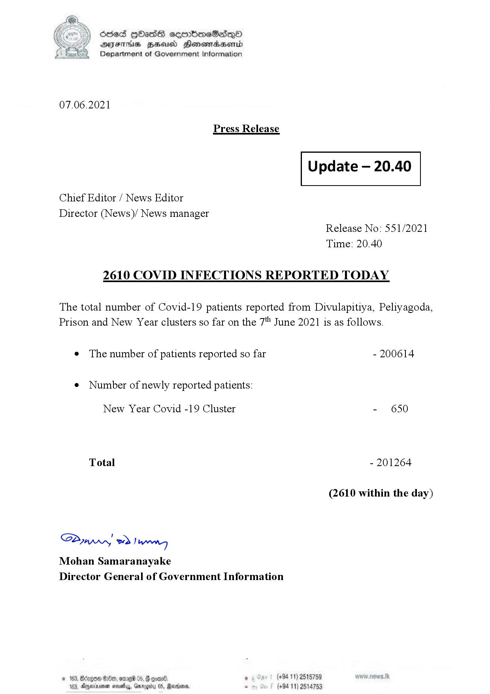

# Press Release - 2021.06.07 - Covid 19 infection report 
Key: d8c036d0e2fdd23427c8e051a621f848 

---
```
)) Sed HOads seembmeSadQo
Y AYsTH1s BHeusd Henemradasenrd
(©) Department of Government Information

 

07.06.2021

Press Release

 

Update — 20.40

 

 

 

Chief Editor / News Editor
Director (News)/ News manager
Release No: 551/2021
Time: 20.40
2610 COVID INFECTIONS REPORTED TODAY

The total number of Covid-19 patients reported from Divulapitiya, Peliyagoda,
Prison and New Year clusters so far on the 7" June 2021 is as follows.

e The number of patients reported so far - 200614

¢ Number of newly reported patients:

New Year Covid -19 Cluster - 650
Total - 201264
(2610 within the day)

Saw 2) won,
Mohan Samaranayake
Director General of Government Information

© 163, Bongo #200, ome 05, G goan® , (+94 11) 2518759
163, Agere naethy, Gmrogiby 05, Rereisons, - (+94 11) 2514753

```
