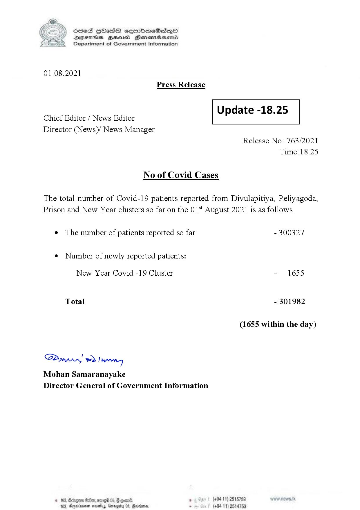

# Press Release - 2021.08.01 
Key: d9fd7a204a5578ef469574c8a775233d 

---
```
S) ScseS HOasdS cerrbmeSdQo
DFTs BHEosd Henewtaeasernid
Department of Government Information

 

01.08.2021
Press Release

 

Update -18.25

 

 

Chief Editor / News Editor
Director (News)/ News Manager

 

Release No: 763/2021
Time: 18.25

No of Covid Cases

The total number of Covid-19 patients reported from Divulapitiya, Peliyagoda,
Prison and New Year clusters so far on the 01* August 2021 is as follows.

¢ The number of patients reported so far - 300327

¢ Number of newly reported patients:

New Year Covid -19 Cluster - 1655
Total - 301982
(1655 within the day)

SPywwwy > Ian
Mohan Samaranayake
Director General of Government Information

© 183,8 280, omg 05, @ goad » (+94 11) 2515789
183, Dyernioner novelas, Gmrogity 0S, Marion, . (+94 11) 2514753

 

```
