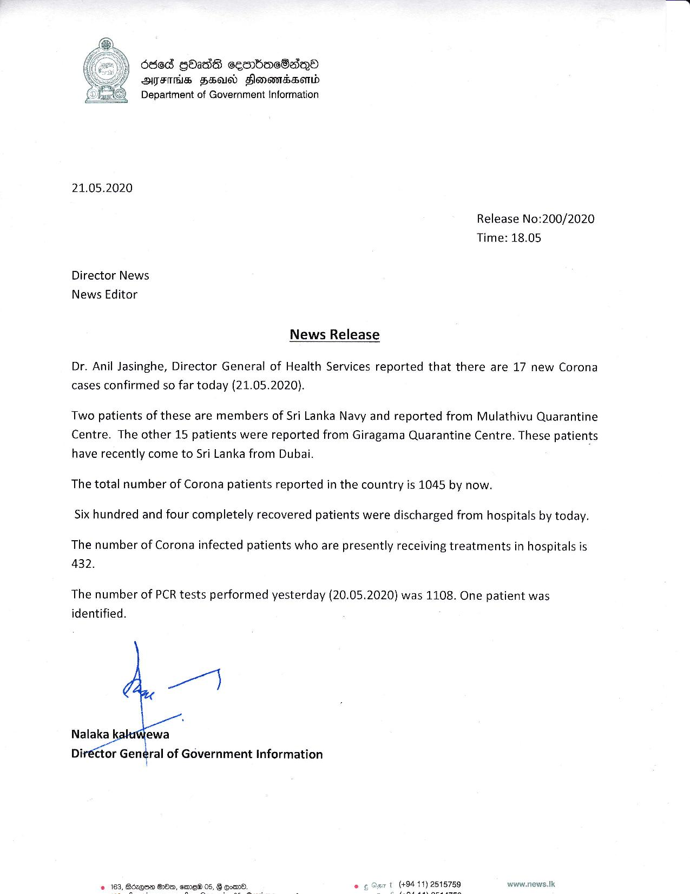

# Press Release - 2020.05.21 - 17 new corona cases have been confirmed today 
Key: da1bb5341ca66e017b58c1127e4a4bc2 

---
```
6868 Gass ce=mbacBasn&
OFTHIS HEU Hlonomadasond
Department of Government Information

 

21.05.2020

Release No:200/2020
Time: 18.05

Director News
News Editor
News Release

Dr. Anil Jasinghe, Director General of Health Services reported that there are 17 new Corona
cases confirmed so far today (21.05.2020).

Two patients of these are members of Sri Lanka Navy and reported from Mulathivu Quarantine
Centre. The other 15 patients were reported from Giragama Quarantine Centre. These patients
have recently come to Sri Lanka from Dubai.

The total number of Corona patients reported in the country is 1045 by now.
Six hundred and four completely recovered patients were discharged from hospitals by today.

The number of Corona infected patients who are presently receiving treatments in hospitals is
432.

The number of PCR tests performed yesterday (20.05.2020) was 1108. One patient was
identified.

 

www.news.lk

 

© 163, Bdzqem De, eme®

 

```
