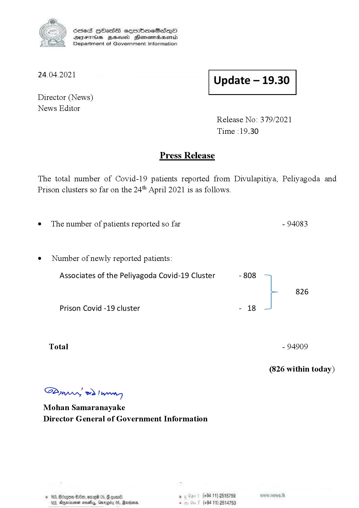

# Press Release - 2021.04.24 
Key: da61aaa8362575206310d5d1682655f0 

---
```
S) ScseS HOasdS cerrbmeSdQo
SVsThis geod Henssnadasombd
Department of Government Information

 

 

24.04.2021 Update — 19.30

 

 

 

Director (News)

News Editor
Release No: 379/2021
Time :19.30

Press Release
The total number of Covid-19 patients reported from Divulapitiya, Peliyagoda and
Prison clusters so far on the 24" April 2021 is as follows.

e¢ The number of patients reported so far - 94083

¢ Number of newly reported patients:

Associates of the Peliyagoda Covid-19 Cluster - 808
826
Prison Covid -19 cluster - 18
Total - 94909
(826 within today)

Saw 2) wong
Mohan Samaranayake
Director General of Government Information

© 163, Btagow 80, ore 05, # gone , (+94 11) 2515759
183, Ayecinimes wovelay, Garogity 05, Marian . (+94 11) 2514753

```
