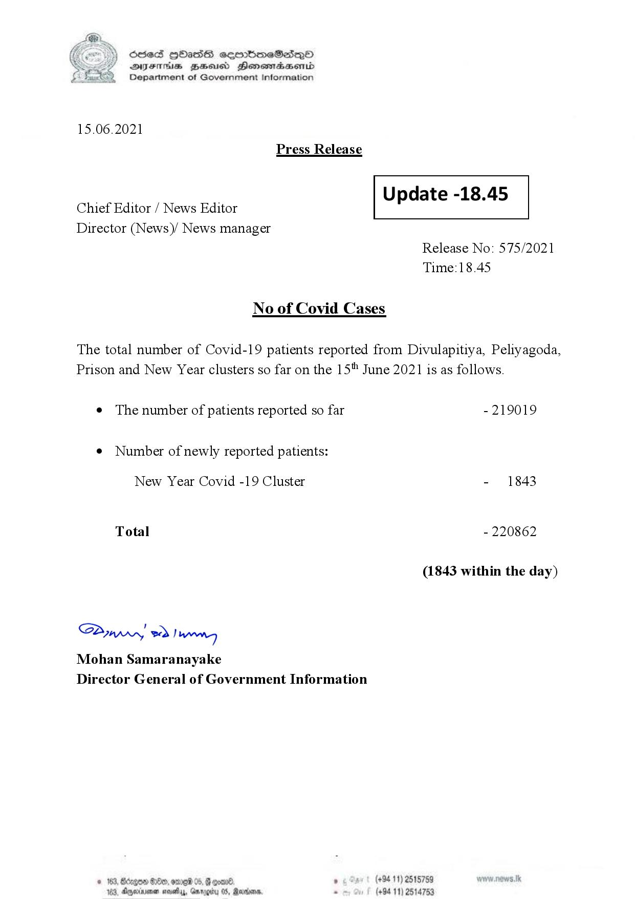

# Press Release - 2021.06.15 
Key: da8b987289626d476e8a4490bd42d3fe 

---
```
S) ScseS HOasdS cerrbmeSdQo
DFTs BHEosd Henewtaeasernid
Department of Government Information

 

15.06.2021
Press Release

 

Update -18.45

 

 

Chief Editor / News Editor
Director (News)/ News manager

 

Release No: 575/2021
Time:18.45

No of Covid Cases

The total number of Covid-19 patients reported from Divulapitiya, Peliyagoda,
Prison and New Year clusters so far on the 15" June 2021 is as follows.

¢ The number of patients reported so far - 219019

¢ Number of newly reported patients:

New Year Covid -19 Cluster - 1843
Total - 220862
(1843 within the day)

Sw 2) wn
Mohan Samaranayake
Director General of Government Information

© 163, Bdogon $00, ome 0 p. . (+9411) 2515759
103, Agere nays, Garey 05, Rardin . (+94 11) 2514753

 
 

```
