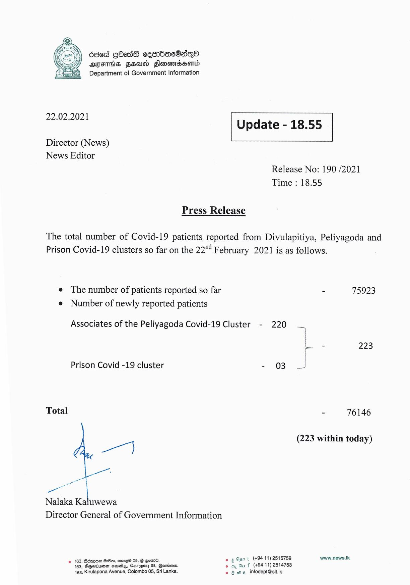

# Press Release - 2021.02.22 
Key: dc20bf17a5463a1a18c38d342b9c8086 

---
```
686d GOadS cesrdacOaqno
OSHS Feud Slonomedsond
Department of Government Information

 

 

22.02.2021 Update - 18.55

 

 

 

Director (News)
News Editor

Release No: 190 /2021
Time : 18.55

Press Release

The total number of Covid-19 patients reported from Divulapitiya, Peliyagoda and
Prison Covid-19 clusters so far on the 22" February 2021 is as follows.

e The number of patients reported so far - 75923
e Number of newly reported patients
L - 223
¥

Associates of the Peliyagoda Covid-19 Cluster - 220

Prison Covid -19 cluster - 03

Total - 76146

(223 within today)

aa)

ee

Saad
Nalaka Kaluwewa
Director General of Government Information

163, Bdrqo@ B28, ere 05, Gotan. © ¢ Opn t (+94 11) 2515759 www.news.1k
° 169, Sgedumen aauahys, Garapdy 05, Bortions omy Gu f (+94 11) 2514753
463, Kirulapona Avenue, Colombo 05, Sri Lanka. © @ we infodept@slt.k

```
