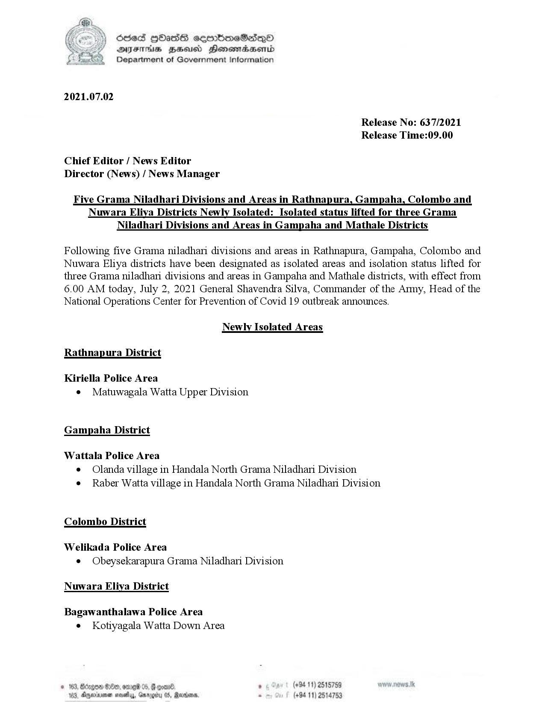

# Press Release - 2021.07.02 - Isolated lifting areas and newly isolated areas 
Key: dc3d48a86c0cadb682f50fbdf6f305a8 

---
```
oseS [Oasis seoonimeSedqQoO
DFTs HHsus Honewadasenrd
Department of Government Information

 

2021.07.02

Release No: 637/2021
Release Time:09.00

Chief Editor / News Editor
Director (News) / News Manager

Five Grama Niladhari Divisions and Areas in Rathnapura, Gampaha, Colombo and
Nuwara Eliya Districts Newly Isolated: Isolated status lifted for three Grama
Niladhari Divisions and Areas in Gampaha and Mathale Districts

Following five Grama niladhari divisions and areas in Rathnapura, Gampaha, Colombo and
Nuwara Eliya districts have been designated as isolated areas and isolation status lifted for
three Grama niladhani divisions and areas in Gampaha and Mathale districts, with effect from
6.00 AM today, July 2, 2021 General Shavendra Silva, Commander of the Army, Head of the
National Operations Center for Prevention of Covid 19 outbreak announces.

Newly Isolated Areas

Rathnapura District

Kiriella Police Area
e¢ Matuwagala Watta Upper Division

Gampaha District
Wattala Police Area
e Olanda village in Handala North Grama Niladhari Division
e Raber Watta village in Handala North Grama Niladhani Division

Colombo District

Welikada Police Area
¢ Obeysekarapura Grama Niladhari Division

Nuwara Eliya District

Bagawanthalawa Police Area
¢ Kotiyagala Watta Down Area

06 . (+94 11) 2515759
, Rags - (+94 11) 28 5

   

```
