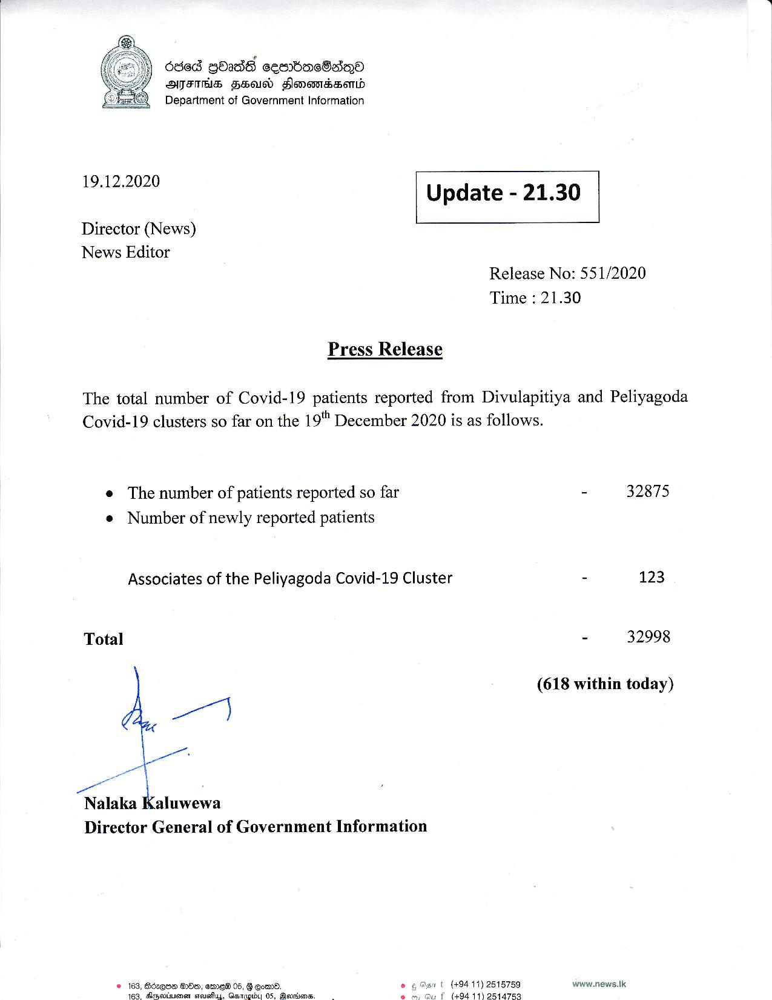

# Press Release - 2020.12.19 
Key: dc680eaf5eed1a8122c3a621c25d1b32 

---
```
686d gOadh cembaeSadeQo
AIFS FHasd Fonemssond
Department of Government Information

 

 

19.12.2020 Update - 21.30

 

 

 

Director (News)
News Editor

Release No: 551/2020
Time : 21.30

Press Release

The total number of Covid-19 patients reported from Divulapitiya and Peliyagoda
Covid-19 clusters so far on the 19" December 2020 is as follows.

e The number of patients reported so far
e Number of newly reported patients

Associates of the Peliyagoda Covid-19 Cluster

Total

 

Nalaka Kaluwewa
Director General of Government Information

(+94 11) 2615759
1494 11) 2514753

© 163, Boxqae GO, emeW 05, 8 ome. .
Ags. Davwiunen cathe. Danendci 66 team.  : e

  

- 32875

- 123

- 32998

(618 within today)

www.news.lik

```
