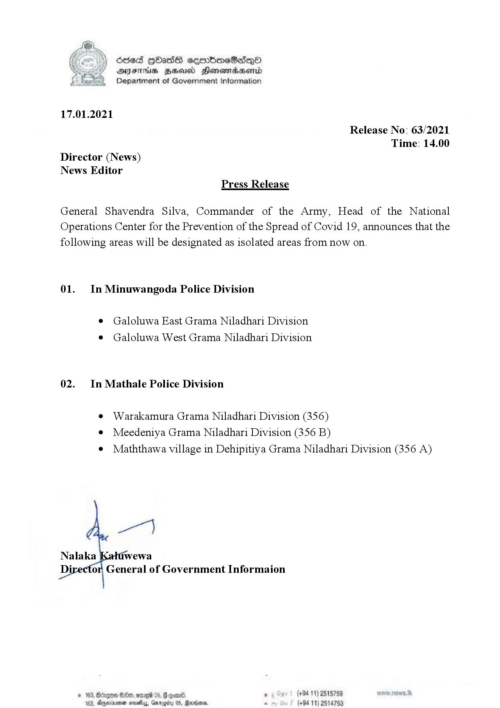

# Press Release - 2021.01.17 - Newly Isolated Areas 
Key: dca9422f475736ca97f7e35462776c62 

---
```
osed HOHass seembmeSadq0
AIFS HHA Honewiaaserid
Department of Government Information

 

17.01.2021
Release No: 63/2021
Time: 14.00

Director (News)
News Editor
Press Release

General Shavendra Silva, Commander of the Army, Head of the National
Operations Center for the Prevention of the Spread of Covid 19, announces that the
following areas will be designated as isolated areas from now on.
01. In Minuwangoda Police Division

¢ Galoluwa East Grama Niladhari Division

¢ Galoluwa West Grama Niladhari Division
02. In Mathale Police Division

e Warakamura Grama Niladhari Division (356)

¢ Meedeniya Grama Niladhari Division (356 B)
¢ Maththawa village in Dehipitiya Grama Niladhari Division (356 A)

ee

Nalaka jwewa
Di or, General of Government Informaion
© 163, Beg G00, ore 05, # ooan® , (+94 11) 2515759

 

163, Ageirna saaty, Garg (+94 11) 2514753

 

```
