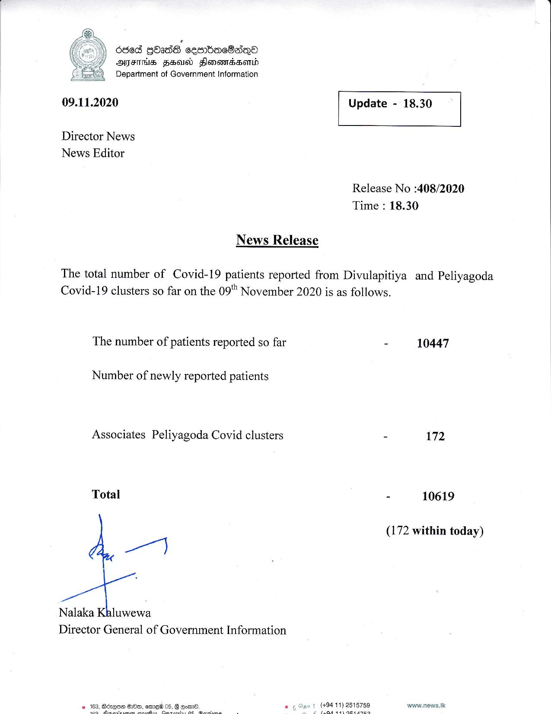

# Press Release - 2020.11.09 
Key: dce93b92dd1fcd86acb181612dacdbe8 

---
```
’
686d GOasdG sembaeOakQ®
AFIS HSU Honontcsontd
Department of Government Information

 

 

09.11.2020 Update - 18.30

 

 

 

Director News
News Editor

Release No :408/2020
Time : 18.30

News Release

The total number of Covid-19 patients reported from Divulapitiya and Peliyagoda
Covid-19 clusters so far on the 09" November 2020 is as follows.

 

The number of patients reported so far - 10447

Number of newly reported patients

Associates Peliyagoda Covid clusters 17:

   

```
