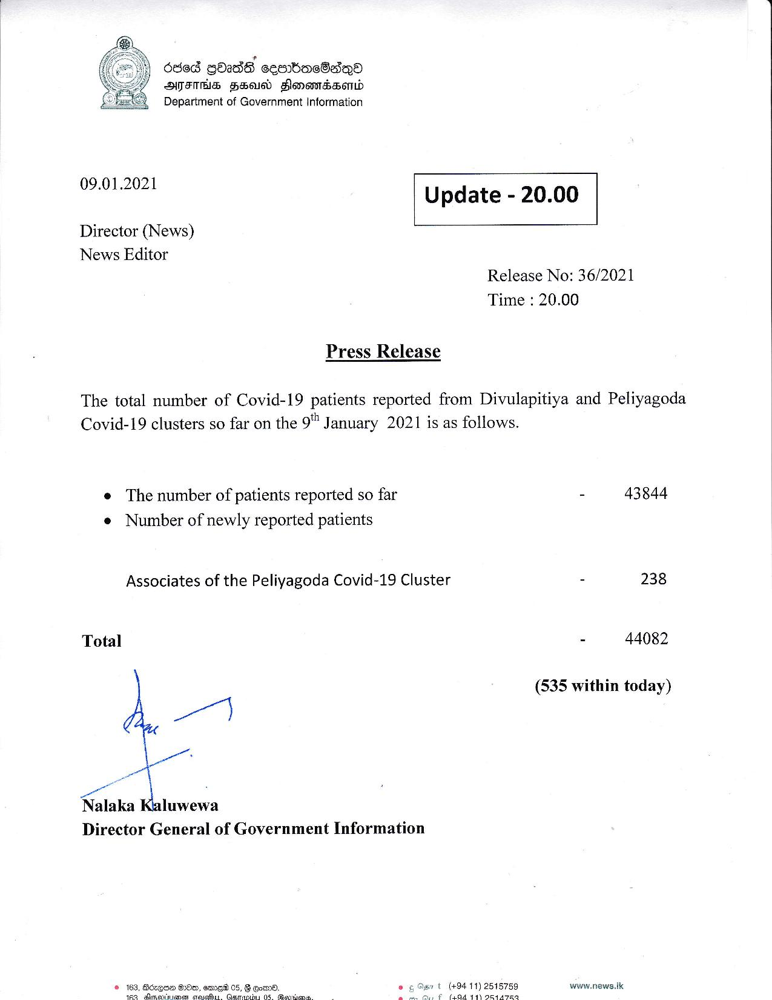

# Press Release - 2021.01.09 
Key: dd4f788246f159c1e612c61afaa6d508 

---
```
*
6ded GbadS cesnbocBaiqQa
MFTS FH Hlonembserd
Department of Government Information

 

 

09.01.2021

 

Update - 20.00

 

 

Director (News)
News Editor

Release No: 36/2021
Time : 20.00

Press Release

The total number of Covid-19 patients reported from Divulapitiya and Peliyagoda

Covid-19 clusters so far on the 9 January 2021 is as follows.

e The number of patients reported so far
e Number of newly reported patients

Associates of the Peliyagoda Covid-19 Cluster

Total

a
watt

ee, .
Nalaka Kaluwewa
Director General of Government Information

t (+9411) 2515759
€ (404 411) On44a769

   

- 43844

= 238

- 44082

(535 within today)

www.news.lk

 

```
