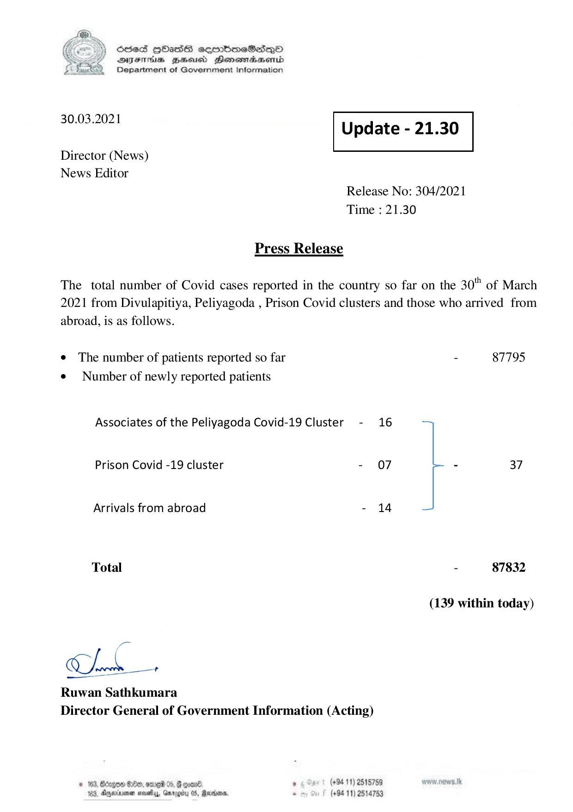

# Press Release - 2021.03.30 
Key: dd73f81f9ffc21fd683c437caa6d4de6 

---
```
) ScdeS HOadS cermbmeSsdQo
DVEFIHS HHosd Honomabsenid
Department of Government Information

 

 

30.03.2021 Update - 21.30

 

 

 

Director (News)
News Editor

Release No: 304/2021
Time : 21.30

Press Release

The total number of Covid cases reported in the country so far on the 30" of March
2021 from Divulapitiya, Peliyagoda , Prison Covid clusters and those who arrived from
abroad, is as follows.

e The number of patients reported so far - 87795
¢ Number of newly reported patients

Associates of the Peliyagoda Covid-19 Cluster - 16

Prison Covid -19 cluster - 07 - 37

Arrivals from abroad - 14

Total - 87832

(139 within today)
Ruwan Sathkumara
Director General of Government Information (Acting)
© 163, Bdegoe Ge, ome 05, F goan8. . (+94 11) 2515789

163, Aparna sosty, Garggitu 05, Rana, - (+94 11) 2514753

```
