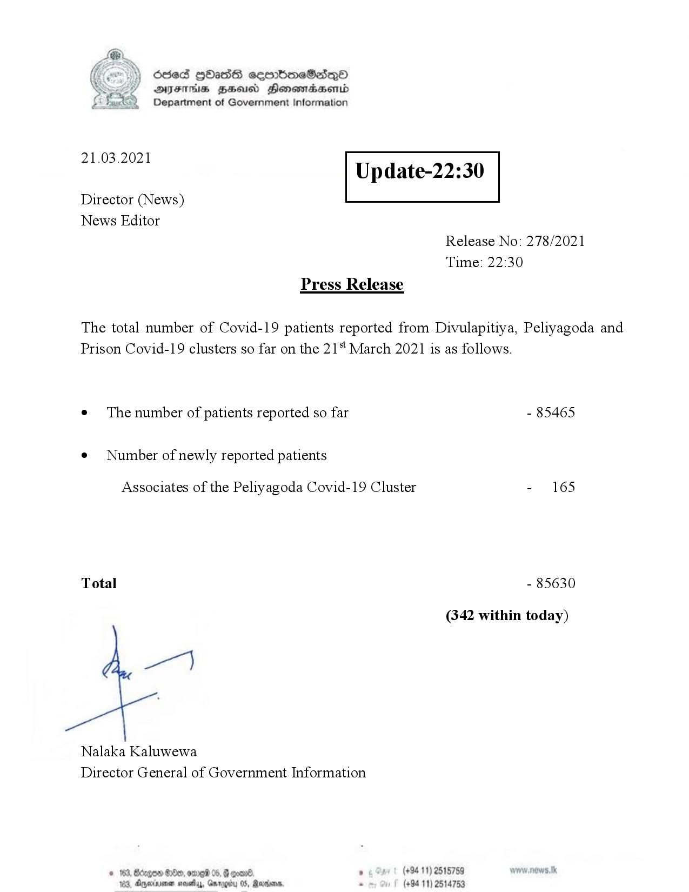

# Press Release - 2021.03.21 
Key: dd745e435542d58e6754f265285b408e 

---
```
Ssed HbasG sembmeSadqo
DAIS BHU Honomasentd
Department of Government Information

 

 

21.03.2021

Update-22:30

 

 

 

Director (News)
News Editor
Release No: 278/2021
Time: 22:30
Press Release

The total number of Covid-19 patients reported from Divulapitiya, Peliyagoda and
Prison Covid-19 clusters so far on the 21" March 2021 is as follows.
e¢ The number of patients reported so far - 85465

¢ Number of newly reported patients

Associates of the Peliyagoda Covid-19 Cluster - 165

Total - 85630

(342 within today)

pe)

Nalaka Kaluwewa
Director General of Government Information

oul 5 (+94 11) 2515759
u 05, Rane. . (+94 11) 2514753

© 163, Bdegoe Seo, ome 05,
163, Dgperivenen mosey, Gav

    

```
