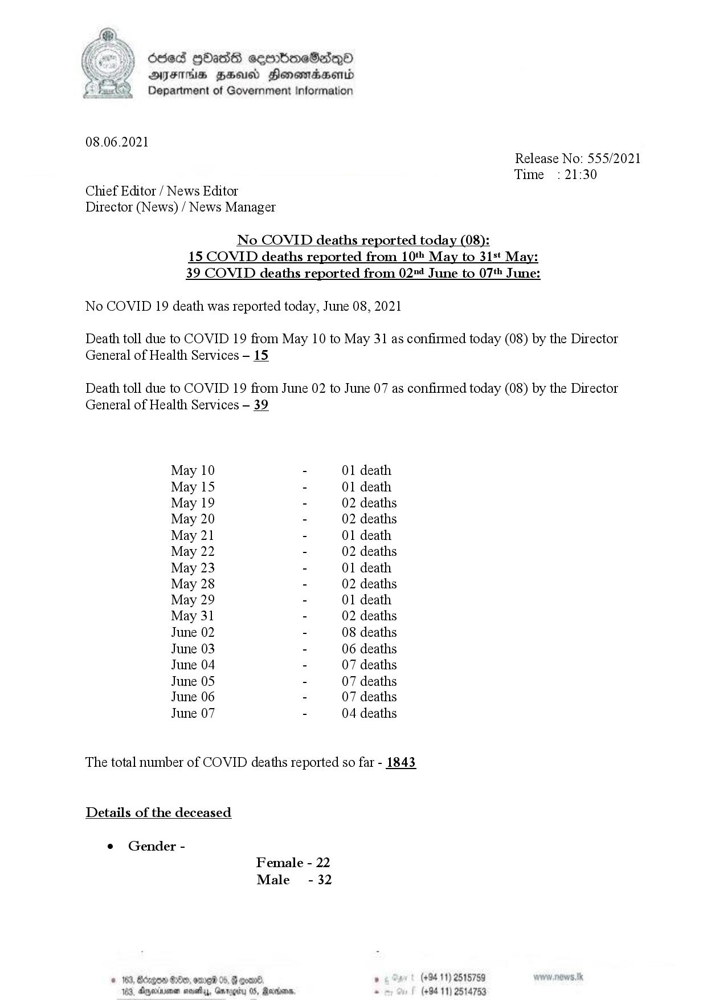

# Press Release - 2021.06.08 - Covid 19 infection deaths 
Key: dd95d3dd77df2bcbdc4a59487d280baa 

---
```
ded [Oss cermboeSadqQod
AJFTHS HEU Honomadwend
Department of Government Information

 

08.06.2021
Release No: 555/2021
Time : 21:30

Chief Editor / News Editor

Director (News) / News Manager

No COVID deaths reported today (08):
15 COVID deaths reported from 10 May to 31st May:
39 COVID deaths reported from 024 June to 07 June:

 

No COVID 19 death was reported today, June 08, 2021

Death toll due to COVID 19 from May 10 to May 31 as confirmed today (08) by the Director
General of Health Services -— 15.

Death toll due to COVID 19 from June 02 to June 07 as confirmed today (08) by the Director
General of Health Services — 39.

May 10 - 01 death
May 15 - 01 death
May 19 - 02 deaths
May 20 - 02 deaths
May 21 - 01 death
May 22 - 02 deaths
May 23 - 01 death
May 28 - 02 deaths
May 29 - 01 death
May 31 - 02 deaths
June 02 - 08 deaths
June 03 - 06 deaths
June 04 - 07 deaths
June 05 - 07 deaths
June 06 - 07 deaths
June 07 - 04 deaths

The total number of COVID deaths reported so far - 1843

Details of the deceased

¢ Gender -
Female - 22
Male - 32
© 163, Bdzgows 8c, orre8 05, & oon ° (+94 11) 2515759

  
 

183. Aryevinsonen a Garogiby 05, Rarians. . (+94 11) 2514753

 

```
