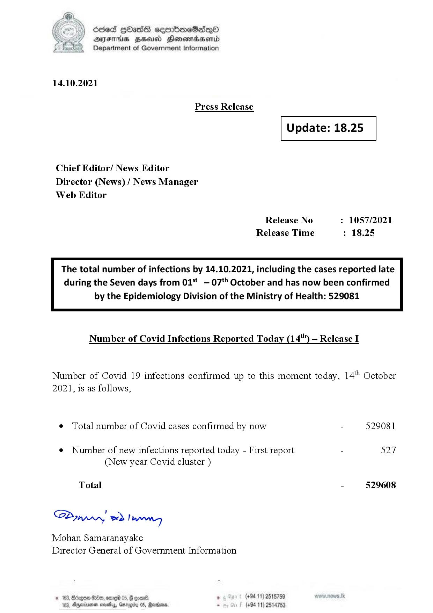

# Press Release - 2021.10.14 
Key: dea892943ddefa52e97312fe0b5d2dd2 

---
```
6863 GOasds sembmeSadqQo
AIFS HSA Honomasentd
Department of Government Information

 

14.10.2021

Press Release

 

Update: 18.25

 

 

 

Chief Editor/ News Editor
Director (News) / News Manager
Web Editor

Release No : 1057/2021
Release Time : 18.25

The total number of infections by 14.10.2021, including the cases reported late
during the Seven days from 01* -07*" October and has now been confirmed

by the Epidemiology Division of the Ministry of Health: 529081

 

Number of Covid Infections Reported Today (14") — Release I

Number of Covid 19 infections confirmed up to this moment today, 14" October
2021, is as follows,

¢ Total number of Covid cases confirmed by now - 529081

¢ Number of new infections reported today - First report - 527
(New year Covid cluster )

Total - 529608

SP ynprn! wd! wong

Mohan Samaranayake
Director General of Government Information

    

80, eneb 0 6 ° (+94 11) 2515759
3 Agyernimen sos, Gnrogity 05, Mandan = (+94 11) 2514753

```
