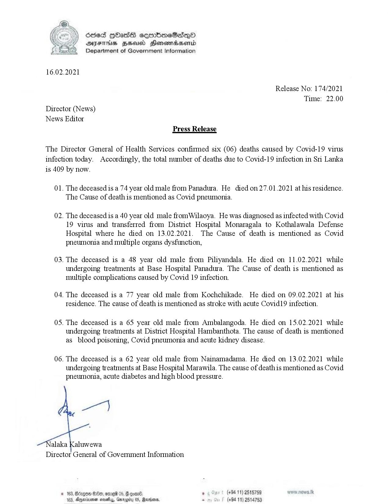

# Press Release - 2021.02.16 - Covid 19 infection deaths 
Key: df2a0e0287e7e351d1b436fe53e34a5b 

---
```
foe) Oded [bas eerrbmeSede—QO
AIFS FBSA Honewmadsenid
Department of Government Information

 

16.02.2021

Release No: 174/2021
Time: 22.00
Director (News)
News Editor
Press Release

The Director General of Health Services confirmed six (06) deaths caused by Covid-19 virus
infection today. Accordingly, the total number of deaths due to Covid-19 infection in Sri Lanka
is 409 by now.

01. The deceased is a 74 year old male from Panadura. He died on 27.01.2021 at his residence.
The Cause of death is mentioned as Covid pneumonia.

02. The deceased is a 40 year old male fromWilaoya. He was diagnosed as infected with Covid
19 virus and transferred from District Hospital Monaragala to Kothalawala Defense
Hospital where he died on 13.02.2021. The Cause of death is mentioned as Covid
pneumonia and multiple organs dysfunction,

03. The deceased is a 48 year old male from Piliyandala. He died on 11.02.2021 while
undergoing treatments at Base Hospital Panadura. The Cause of death is mentioned as
multiple complications caused by Covid 19 infection.

04. The deceased is a 77 year old male from Kochchikade. He died on 09.02.2021 at his
residence. The cause of death is mentioned as stroke with acute Covid19 infection.

05. The deceased is a 65 year old male from Ambalangoda. He died on 15.02.2021 while
undergoing treatments at District Hospital Hambanthota. The cause of death is mentioned
as_ blood poisoning, Covid pneumonia and acute kidney disease.

06. The deceased is a 62 year old male from Nainamadama. He died on 13.02.2021 while

undergoing treatments at Base Hospital Marawila. The cause of deathis mentioned as Covid
pneumonia, acute diabetes and high blood pressure.

ye)

alaka Kaluwewa
Director General of Government Information

~ (+94 11) 2515759
Barns, - (+94 11) 2514753

© 163, Bongos 800, ome 05, @
123, dgeineen novaay, Gw

 

 

```
