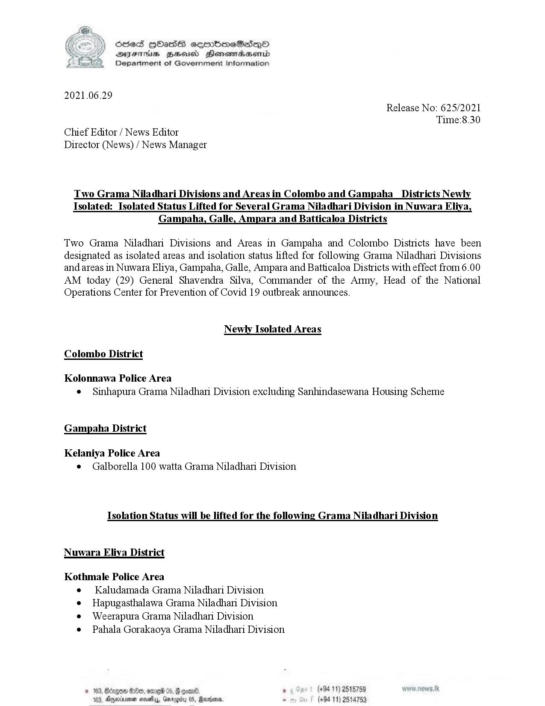

# Press Release - 2021.06.29 - Newly Isolated areas and isolated lifting areas 
Key: dfd91f5a17ac94e45bf91a5ff7180de5 

---
```
fC ) Scted HOass ceembmeSasqoO
x DYSETMS BBeusd Hones send
Department of Government Information

 

2021.06.29
Release No: 625/2021
Time:8.30
Chief Editor / News Editor
Director (News) / News Manager

Two Grama Niladhari Divisions and Areas in Colombo and Gampaha__Districts Newly
Isolated: Isolated Status Lifted for Several Grama Niladhari Division in Nuwara Eliya,

Gampaha, Galle, Ampara and Batticaloa Districts

Two Grama Niladhan Divisions and Areas in Gampaha and Colombo Districts have been
designated as isolated areas and isolation status lifted for following Grama Niladhani Divisions
and areas in Nuwara Eliya, Gampaha, Galle, Ampara and Batticaloa Districts with effect from 6.00
AM today (29) General Shavendra Silva, Commander of the Army, Head of the National
Operations Center for Prevention of Covid 19 outbreak announces.

Newly Isolated Areas

 

Colombo District

Kolonnawa Police Area
e Sinhapura Grama Niladhari Division excluding Sanhindasewana Housing Scheme

Gampaha District

Kelaniya Police Area
¢ Galborella 100 watta Grama Niladhari Division

Isolation Status will be lifted for the following Grama Niladhari Division

Nuwara Eliya District

Kothmale Police Area
e  Kaludamada Grama Niladhari Division.
e Hapugasthalawa Grama Niladhari Division
e Weerapura Grama Niladhari Division
e Pahala Gorakaoya Grama Niladhari Division

   

```
