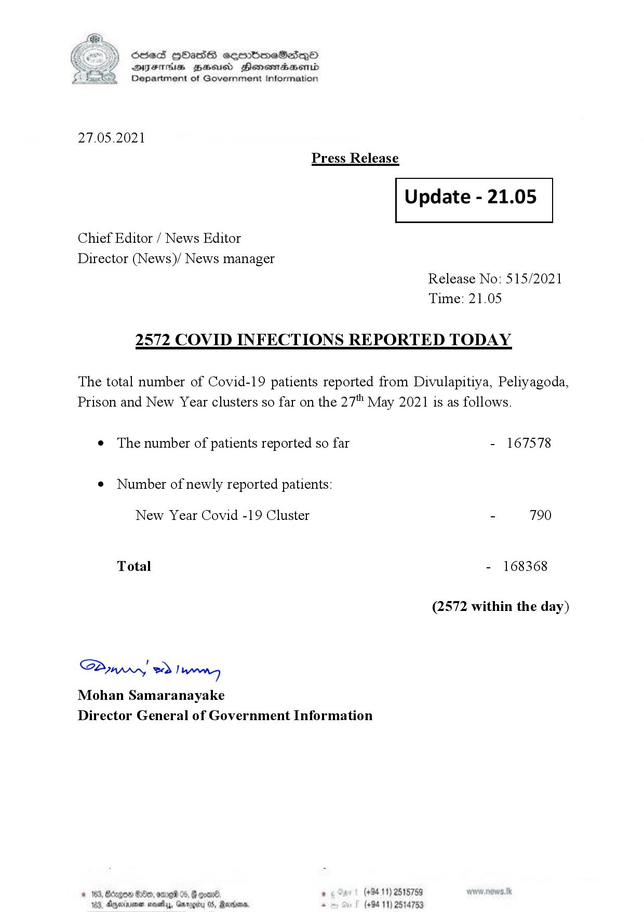

# Press Release - 2021.05.27 - Covid 19 infection report 
Key: dfdcc09378c3b734b5f2cb6570de2d26 

---
```
(6 S) ScseS HOasdS cerrbmeSdQo
DFTs BHEosd Henewtaeasernid
Department of Government Information

 

27.05.2021
Press Release

 

Update - 21.05

 

 

 

Chief Editor / News Editor

Director (News)/ News manager
Release No: 515/2021
Time: 21.05

2572 COVID INFECTIONS REPORTED TODAY

The total number of Covid-19 patients reported from Divulapitiya, Peliyagoda,
Prison and New Year clusters so far on the 27" May 2021 is as follows.

e The number of patients reported so far - 167578

¢ Number of newly reported patients:

New Year Covid -19 Cluster - 790
Total - 168368
(2572 within the day)

Saw 2) won,
Mohan Samaranayake
Director General of Government Information

© 163, Borgen 0, ome 05, onan , (+94 11) 2515759
103, Ayminumen neal, Garogity 05, Marden . (+94 11) 2514753

 

```
