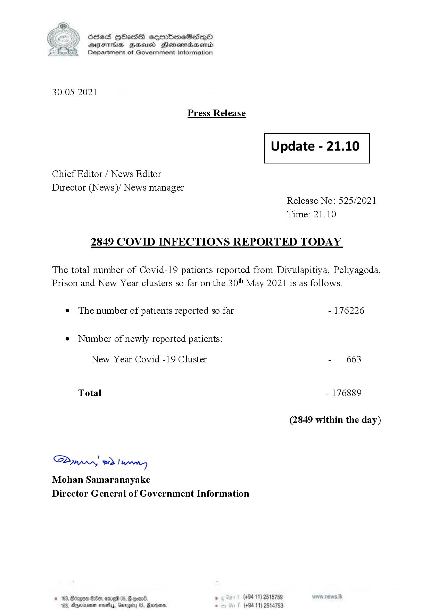

# Press Release - 2021.05.30 - Covid 19 infection report 
Key: e08072911aac6358a6a458e92ff32d28 

---
```
(6 S) ScseS HOasdS cerrbmeSdQo
DFTs BHEosd Henewtaeasernid
Department of Government Information

 

30.05.2021

Press Release

 

Update - 21.10

 

 

 

Chief Editor / News Editor

Director (News)/ News manager
Release No: 525/2021
Time: 21.10

2849 COVID INFECTIONS REPORTED TODAY

The total number of Covid-19 patients reported from Divulapitiya, Peliyagoda,
Prison and New Year clusters so far on the 30" May 2021 is as follows.

e The number of patients reported so far - 176226

¢ Number of newly reported patients:

New Year Covid -19 Cluster - 663
Total - 176889
(2849 within the day)

Saw 2) wong
Mohan Samaranayake
Director General of Government Information

 

* 163 Oe, ome 05, F qoav8 , (+94 11) 2515759
2. Apminmen nay, Gameby 05, Rarer * (+94 11) 2514753

```
