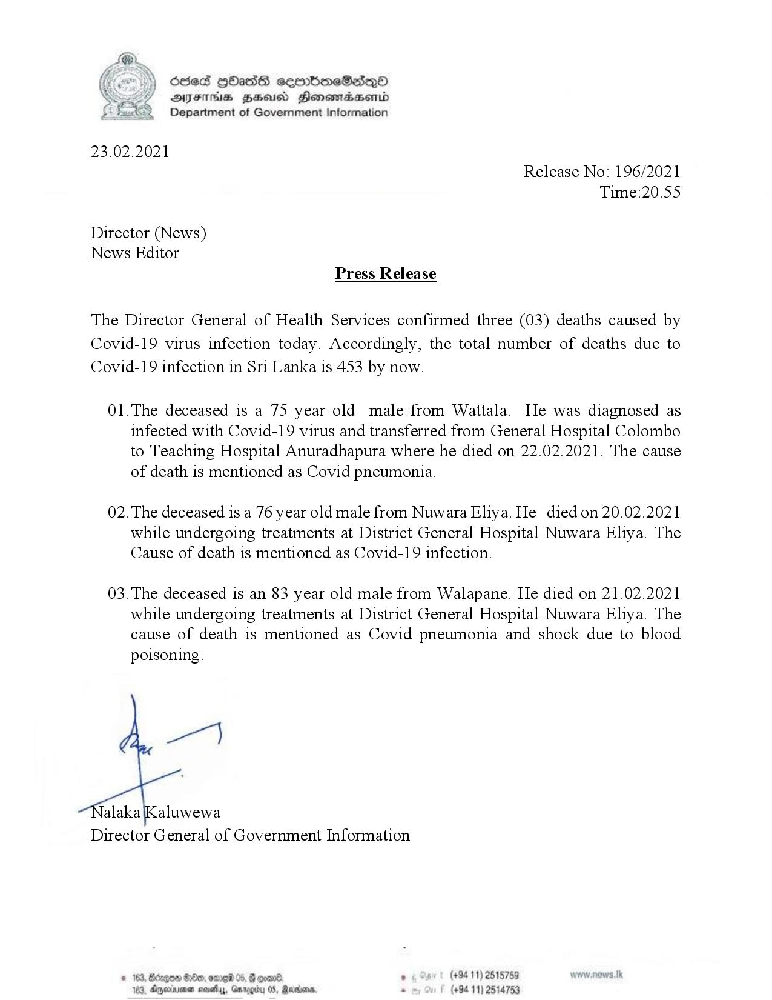

# Press Release - 2021.02.23 - Covid 19 Infection deaths 
Key: e0b3719346706b4ce6d8a356ba95461a 

---
```
(oe) Oded QOass ceerboneS2deQ®
\ Y DSYFThs Bess Henomasond
Department of Government Information

 

23.02.2021
Release No: 196/2021
Time:20.55

Director (News)
News Editor
Press Release

The Director General of Health Services confirmed three (03) deaths caused by
Covid-19 virus infection today. Accordingly, the total number of deaths due to
Covid-19 infection in Sri Lanka is 453 by now.

01.The deceased is a 75 year old male from Wattala. He was diagnosed as
infected with Covid-19 virus and transferred from General Hospital Colombo
to Teaching Hospital Anuradhapura where he died on 22.02.2021. The cause
of death is mentioned as Covid pneumonia.

02. The deceased is a 76 year old male from Nuwara Eliya. He died on 20.02.2021
while undergoing treatments at District General Hospital Nuwara Eliya. The
Cause of death is mentioned as Covid-19 infection.

03.The deceased is an 83 year old male from Walapane. He died on 21.02.2021
while undergoing treatments at District General Hospital Nuwara Eliya. The
cause of death is mentioned as Covid pneumonia and shock due to blood
poisoning.

yen)

alaka\Kaluwewa
Director General of Government Information

G come, , (+94 11) 2515759
41 05, Ravivanss, - (+94 11) 2514753

 
 

© 163, Bdagoe G00, ore 06,
163, Aggerinimen mosey, Gar

  

```
