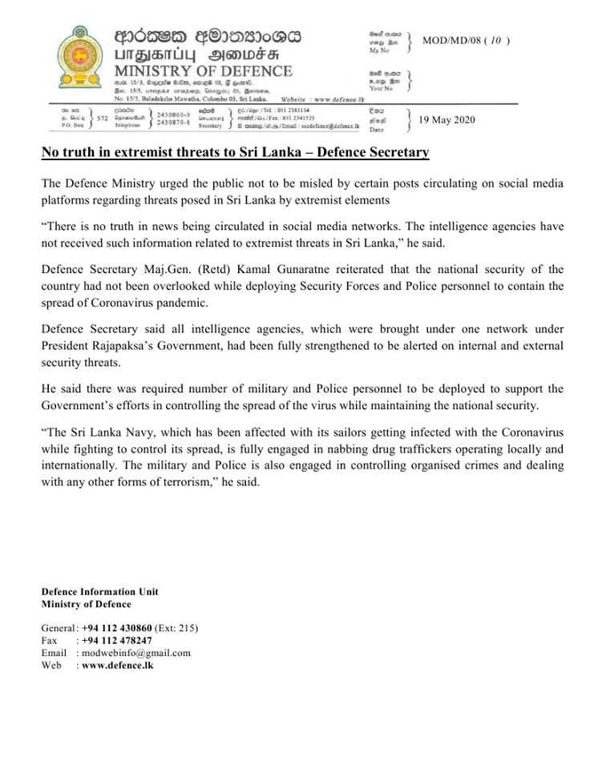

# Press Release - 2020.05.19 - Ministry of Defence 
Key: e12cafcf628f80b27a4f39465440557a 

---
```
Oss FODsI0@B
UTBIGIY Deowss
MINISTRY OF DEFENCE

Sn 7

 

MOD/MD/08 (10 )

  

   

 

19 May 2020

  

No truth in extremist threats to Sri Lanka — Defence Secreta:

 

The Defence Ministry urged the public not to be misled by certain posts circulating on social media
platforms regarding threats posed in Sri Lanka by extremist elements

“There is no truth in news being circulated in social media networks. The intelligence agencies have
not received such information related to extremist threats in Sri Lanka,” he said.

Defence Secretary Maj.Gen. (Retd) Kamal Gunaratne reiterated that the national security of the
country had not been overlooked while deploying Security Forces and Police personnel to contain the
spread of Coronavirus pandemic.

Defence Secretary
President Rajapaks
security threats.

 

id all intelligence agencies, which were brought under one network under
Government, had been fully strengthened to be alerted on internal and external

 

He said there was required number of military and Police personnel to be deployed to support the
Government's efforts in controlling the spread of the virus while maintaining the national security.

“The Sri Lanka Navy, which has been affected with its sailors getting infected with the Coronavirus
while fighting to control its spread, is fully engaged in nabbing drug traffickers operating locally and
internationally. The military and Police is also engaged in controlling organised crimes and dealing
with any other forms of terrorism,” he said.

Defence Information Unit
Ministry of Defence

General: +94 112 430860 (Ext: 215)
Fax: +94 112478247

Email: modwebinfo@gmail.com
Web: www.defencedlk

```
