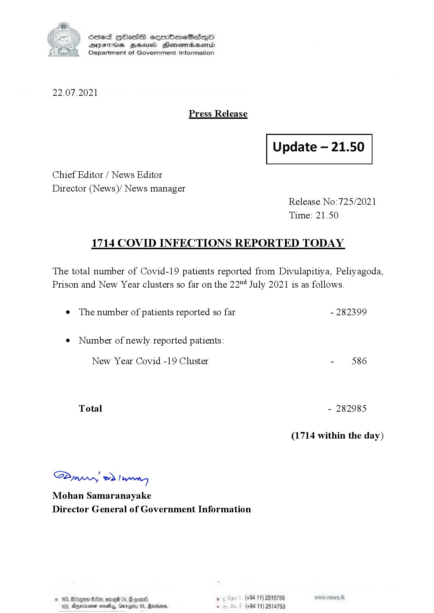

# Press Release - 2021.07.22 
Key: e1985c8c931227c770266fb98f4421de 

---
```
(6 S) ScseS HOasdS cerrbmeSdQo
DFTs BHEosd Henewtaeasernid
Department of Government Information

 

22.07.2021

Press Release

 

Update — 21.50

 

 

 

Chief Editor / News Editor

Director (News)/ News manager
Release No:725/2021
Time: 21.50

1714 COVID INFECTIONS REPORTED TODAY

The total number of Covid-19 patients reported from Divulapitiya, Peliyagoda,
Prison and New Year clusters so far on the 22" July 2021 is as follows.

e The number of patients reported so far - 282399

¢ Number of newly reported patients:

New Year Covid -19 Cluster - 586
Total - 282985
(1714 within the day)

Saw 2) won,
Mohan Samaranayake
Director General of Government Information

© 163, Bdegon G80, ome 0 6 ’ (+94 11) 2515759
163, Agere naethy, Gmrogiby 05, Rereisons, - (+94 11) 2514753

 

```
