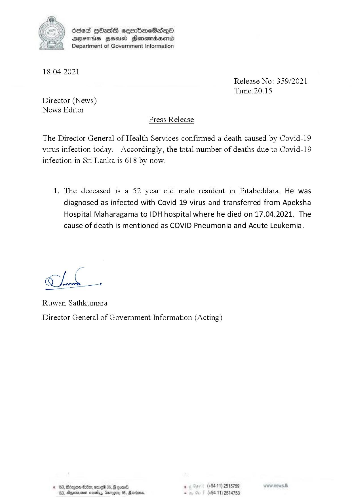

# Press Release - 2021.04.18 - Covid 19 infection deaths 
Key: e198970d3390d3bf304052bdb377d24c 

---
```
ddeS [bas cemrbioeSadQo
AIFS HHUd SHonemadaHenrd
Department of Government Information

 

18.04.2021
Release No: 359/2021

Time:20.15

Director (News)
News Editor
Press Release

The Director General of Health Services confirmed a death caused by Covid-19
virus infection today. Accordingly, the total number of deaths due to Covid-19
infection in Sri Lanka is 618 by now.

1. The deceased is a 52 year old male resident in Pitabeddara. He was
diagnosed as infected with Covid 19 virus and transferred from Apeksha
Hospital Maharagama to IDH hospital where he died on 17.04.2021. The
cause of death is mentioned as COVID Pneumonia and Acute Leukemia.

Cha

Ruwan Sathkumara

 

Director General of Government Information (Acting)

© 163, Bcagow $80, ore 05, G con® , (+84 11) 2515759
183, Ageia sesety, Garogiry 05, Ravens, - (+94 11) 2514753

```
