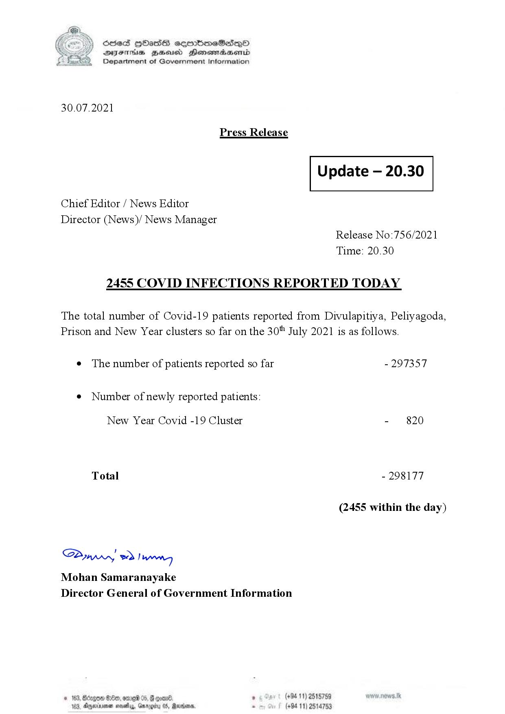

# Press Release - 2021.07.30 - Covid 19 Infection Report 
Key: e27f3370c21b6ca00e6b8492c7bf8082 

---
```
(6 S) ScseS HOasdS cerrbmeSdQo
DFTs BHEosd Henewtaeasernid
Department of Government Information

 

30.07.2021

Press Release

 

Update — 20.30

 

 

 

Chief Editor / News Editor

Director (News)/ News Manager
Release No:756/2021
Time: 20.30

2455 COVID INFECTIONS REPORTED TODAY

The total number of Covid-19 patients reported from Divulapitiya, Peliyagoda,
Prison and New Year clusters so far on the 30" July 2021 is as follows.

e The number of patients reported so far - 297357

¢ Number of newly reported patients:

New Year Covid -19 Cluster - 820
Total - 298177
(2455 within the day)

Saw 2) won,
Mohan Samaranayake
Director General of Government Information

© 163, Bdegon G80, ome 0 6 ’ (+94 11) 2515759
163, Agere naethy, Gmrogiby 05, Rereisons, - (+94 11) 2514753

 

```
