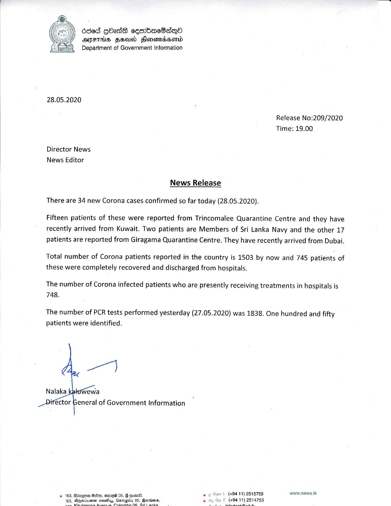

# Press Release - 2020.05.28 - 34 new corona cases have been confirmed today 
Key: e2b6b958694d879cac660c48780c78df 

---
```
636d GbassE cesrbaeSsnO
AHIITHS FSU Honandaonwd
Department of Government Information

 

28.05.2020

Release No:209/2020
Time: 19.00

Director News
News Editor
News Release
There are 34 new Corona cases confirmed so far today (28.05.2020).

Fifteen patients of these were reported from Trincomalee Quarantine Centre and they have
recently arrived from Kuwait. Two patients are Members of Sri Lanka Navy and the other 17
patients are reported from Giragama Quarantine Centre. They have recently arrived from Dubai.

Total number of Corona patients reported in the country is 1503 by now and 745 patients of
these were completely recovered and discharged from hospitals.

The number of Corona infected patients who are presently receiving treatments in hospitals is
748.

The number of PCR tests performed yesterday (27.05.2020) was 1838. One hundred and fifty
patients were identified.

   

Nalaka ewa

eneral of Government Information

www.news.tk

Borqne HOD, sisreW 05, B eomd. =

si Tuy, Gatupiby 05, Berrims. °
Fay a a

   

 

```
