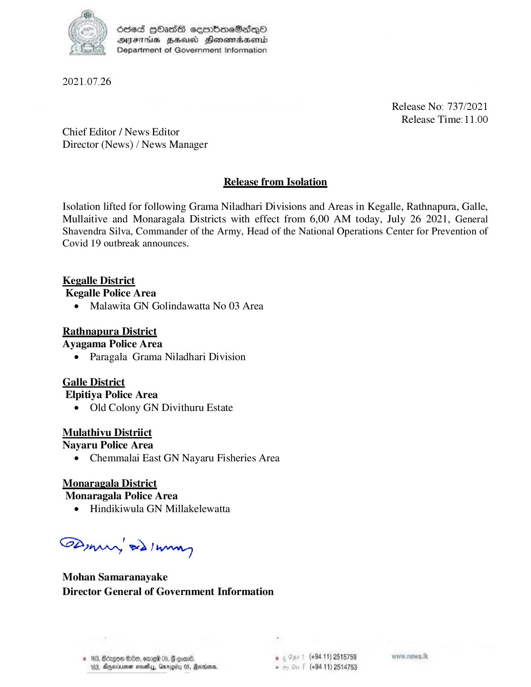

# Press Release - 2021.07.26 - Release fro Isolation 
Key: e2b83e2b28a866650573cd2027708307 

---
```
OseS HOasS sesotmeSaiQo®
ATIIHS BHU Honewmadsertd
Department of Government Information

 

2021.07.26

Chief Editor / News Editor
Director (News) / News Manager

Release from Isolation

Release No: 737/2021
Release Time: 11.00

Isolation lifted for following Grama Niladhari Divisions and Areas in Kegalle, Rathnapura, Galle,
Mullaitive and Monaragala Districts with effect from 6,00 AM today, July 26 2021, General
Shavendra Silva, Commander of the Army, Head of the National Operations Center for Prevention of

Covid 19 outbreak announces.

Kegalle District
Kegalle Police Area

e¢ Malawita GN Golindawatta No 03 Area

Rathnapura District
Ayagama Police Area

e Paragala Grama Niladhari Division

Galle District
Elpitiya Police Area
¢ Old Colony GN Divithuru Estate

Mulathivu Distriict
Nayaru Police Area
e¢ Chemmalai East GN Nayaru Fisheries Area

Monaragala District
Monaragala Police Area

e = Hindikiwula GN Millakelewatta

SPyapry wd Tarnneg

Mohan Samaranayake
Director General of Government Information

 

© 183, Bdzgow $60, omre 05
163. Agywinimen soe, Ge

 

(+94 11) 2515759
(+94 11) 2514753

```
