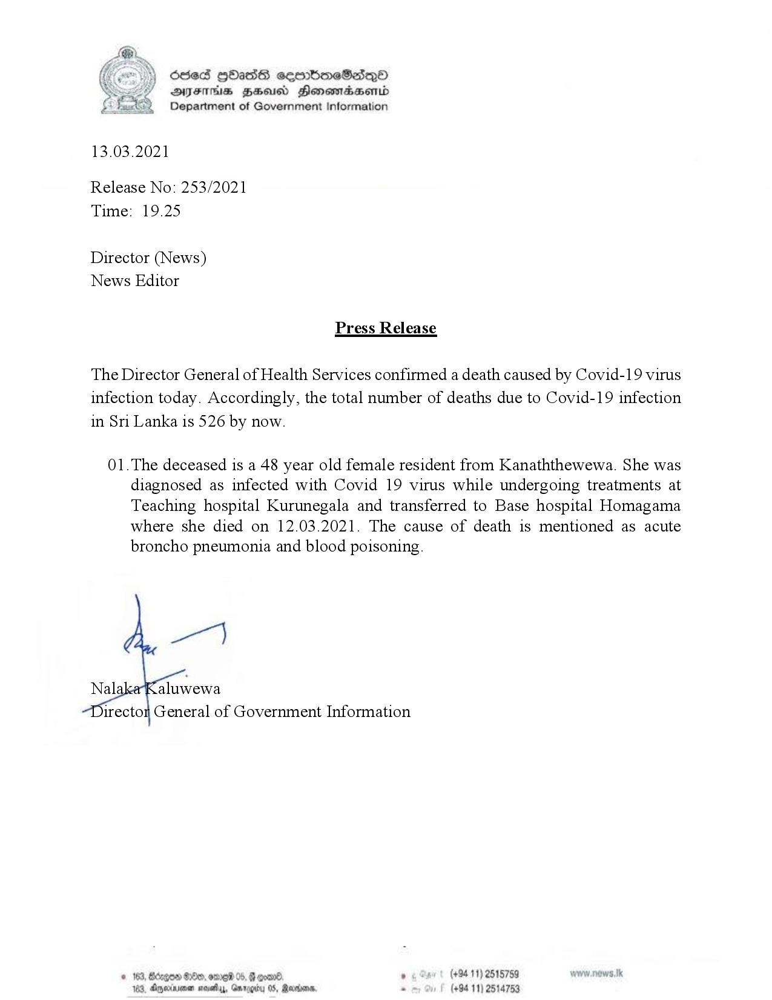

# Press Release - 2021.03.13 - Covid 19 infection deaths 
Key: e3027f24a1658f68a6f75f5b0d66f715 

---
```
osed HOasG sembmeSadqoO
AIFS BHU Honewiadserid
Department of Government Information

 

13.03.2021

Release No: 253/2021
Time: 19.25

Director (News)
News Editor

Press Release

The Director General of Health Services confirmed a death caused by Covid-19 virus
infection today. Accordingly, the total number of deaths due to Covid-19 infection
in Sri Lanka is 526 by now.

01.The deceased is a 48 year old female resident from Kanaththewewa. She was
diagnosed as infected with Covid 19 virus while undergoing treatments at
Teaching hospital Kurunegala and transferred to Base hospital Homagama
where she died on 12.03.2021. The cause of death is mentioned as acute
broncho pneumonia and blood poisoning.

   

irectoy General of Government Information

"8 , (+94 11) 2515759
183, Dgexrsnen masts, Gmrogiiey 05, Revrisene, - (+94 11) 2514753

 

```
