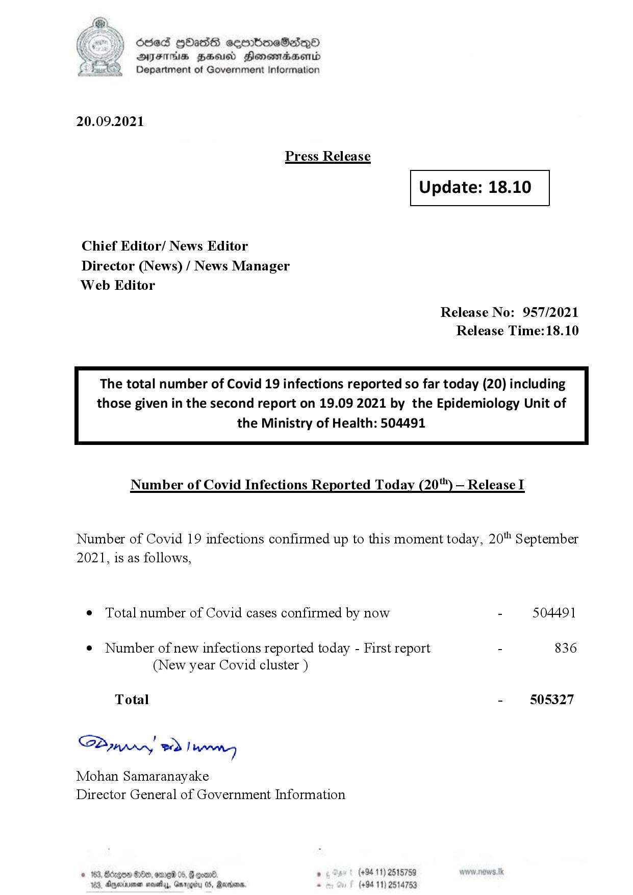

# Press Release - 2021.09.20 
Key: e33ca80ec2a7fe04f65a7065a6317793 

---
```
dosed Hbash sermimeSadeqyO
ATITHIS BHU Honowmadsertd
Department of Government Information

 

20.09.2021

Press Release

 

Update: 18.10

 

 

 

Chief Editor/ News Editor
Director (News) / News Manager
Web Editor

Release No: 957/2021
Release Time:18.10

The total number of Covid 19 infections reported so far today (20) including
those given in the second report on 19.09 2021 by the Epidemiology Unit of

the Ministry of Health: 504491

 

Number of Covid Infections Reported Today (20) — Release I

Number of Covid 19 infections confirmed up to this moment today, 20" September
2021, is as follows,

¢ Total number of Covid cases confirmed by now - 504491

¢ Number of new infections reported today - First report - 836
(New year Covid cluster )

Total - 505327

SPyyprny wd! wong

Mohan Samaranayake
Director General of Government Information

© 163, Borgo 8200, ome 0
103, Agerivenen sot, Garey 0S, Rare

   

```
