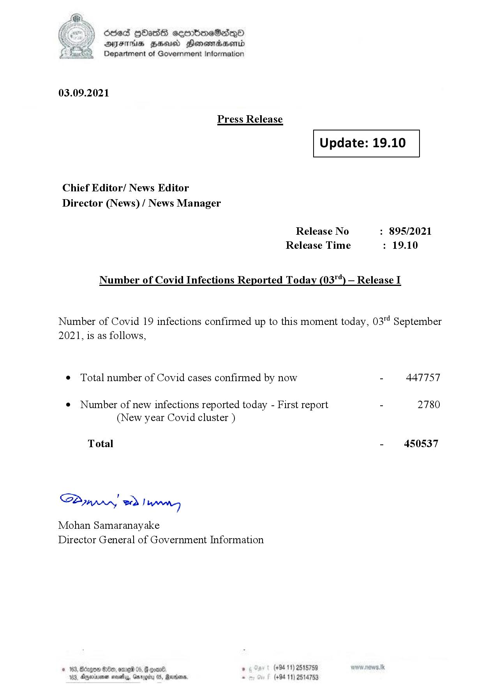

# Press Release - 2021.09.03 
Key: e368618cc2432bd6e2648c2f2aecbea0 

---
```
(2) Oded QOasS cseenboeSiqQo
DFS HHS Honsmnadaerntd
Department of Government Information

 

03.09.2021

Press Release

 

Update: 19.10

 

 

 

Chief Editor/ News Editor
Director (News) / News Manager

Release No : 895/2021
Release Time : 19.10

Number of Covid Infections Reported Today (03") — Release I

Number of Covid 19 infections confirmed up to this moment today, 03" September
2021, is as follows,

¢ Total number of Covid cases confirmed by now - 447757

¢ Number of new infections reported today - First report - 2780
(New year Covid cluster )

- 450537

Total

SB, eed | Mens

Mohan Samaranayake
Director General of Government Information

   

188, Anexivenan noes, Garogiy 05, Mardoorn,

```
