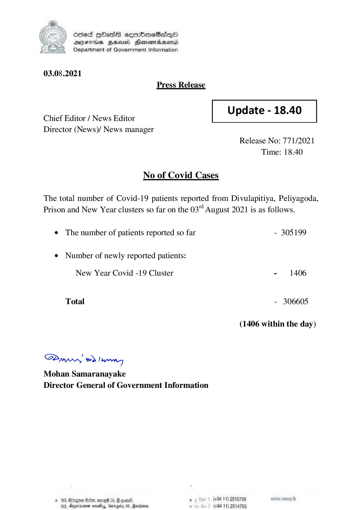

# Press Release - 2021.08.03 
Key: e388f4f46a86fb107bb2741043843ec7 

---
```
| OCced gbass cembmeSadqQo
DFIHS BHU Honsordaentd
Department of Government Information

 

03.08.2021
Press Release

 

Update - 18.40

 

 

Chief Editor / News Editor
Director (News)/ News manager

 

Release No: 771/2021
Time: 18.40

No of Covid Cases

The total number of Covid-19 patients reported from Divulapitiya, Peliyagoda,
Prison and New Year clusters so far on the 03 August 2021 is as follows.

¢ The number of patients reported so far - 305199
¢ Number of newly reported patients:

New Year Covid -19 Cluster - 1406

Total - 306605

(1406 within the day)

SPywwwy > Ian
Mohan Samaranayake
Director General of Government Information

© 163, Bdagon $0, omreld 05, @ ooame , (+94 11) 2518789
103, Agerrna nevetiy, Garogity 05, Ravina, - (+94 11) 2514753

```
