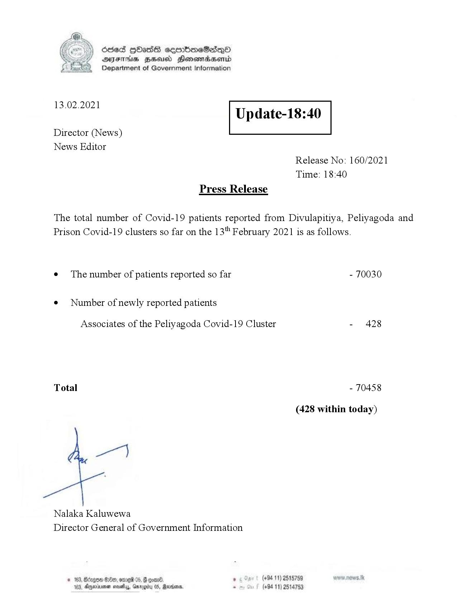

# Press Release - 2021.02.13 
Key: e4003b9d3a3212eaf0bad3ea4f79f5af 

---
```
Ssed HbasG sembmeSadqo
DAIS BHU Honomasentd
Department of Government Information

 

 

13.02.2021

Update-18:40

 

 

 

Director (News)
News Editor
Release No: 160/2021
Time: 18:40
Press Release

The total number of Covid-19 patients reported from Divulapitiya, Peliyagoda and
Prison Covid-19 clusters so far on the 13" February 2021 is as follows.
e¢ The number of patients reported so far - 70030

¢ Number of newly reported patients

Associates of the Peliyagoda Covid-19 Cluster - 428

Total - 70458

(428 within today)

Nalaka Kaluwewa
Director General of Government Information

© 163, Bécge &0eo, orme® 05, @ con®. 8 (+94 11) 2515759
163, Agexuee neaty, Grrggiy 05, Rares. - (+94 11) 2514753

 

```
