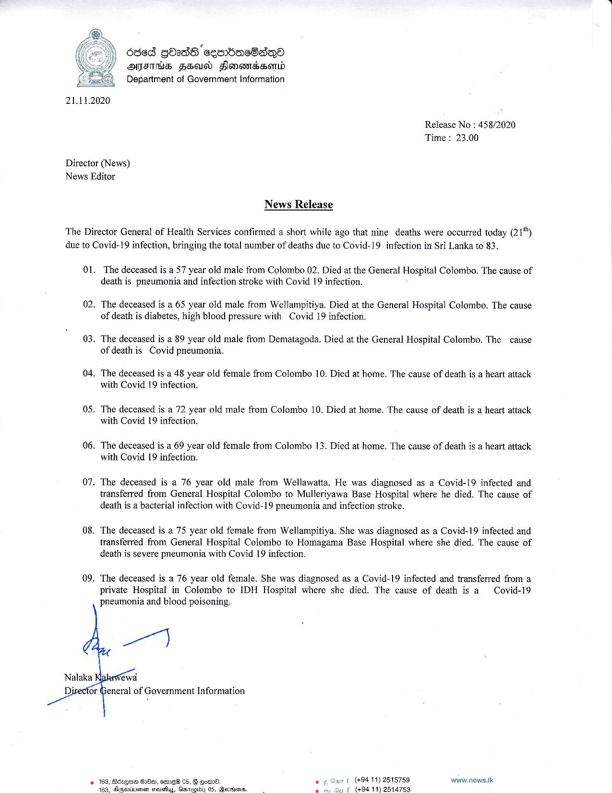

# Press Release - 2020.11.21 - Covid 19 infection death rises to 83 
Key: e41016ee0b7dfafdbcb933700400d0e3 

---
```
  
  

630d ghadS ceenbacBan®
YY ASTM HHosd Honovorebsomd
=) Department of Government Information

21.11.2020
Release No : 458/2020
Time : 23,00

Director (News)
News Editor

News Release

The Director General of Health Services confirmed a short while ago that nine deaths were occurred today (21")
due to Covid-19 infection, bringing the total number of deaths due to Covid-19 infection in Sri Lanka to 83.

Ol. The deceased is a 57 year old male from Colombo 02. Died at the General Hospital Colombo. The cause of
death is pneumonia and infection stroke with Covid 19 infection.

02. The deceased is a 65 year old male from Wellampitiya. Died at the General Hospital Colombo. The cause
of death is diabetes, high blood pressure with Covid 19 infection.

03. The deceased is a 89 year old male from Dematagoda. Died at the General Hospital Colombo. The cause
of death is Covid pneumonia.

04, The deceased is a 48 year old female from Colombo 10. Died at home. The cause of death is a heart attack
with Covid 19 infection.

05. The deceased is a 72 year old male from Colombo 10. Died at home. The cause of death is a heart attack
with Covid 19 infection.

06. The deceased is a 69 year old female from Colombo 13. Died at home. The cause of death is a heart attack
with Covid 19 infection.

07. The deceased is a 76 year old male from Wellawatta. He was diagnosed as a Covid-19 infected and
transferred from General Hospital Colombo to Mulleriyawa Base Hospital where he died. The cause of
death is a bacterial infection with Covid-19 pneumonia and infection stroke.

08. The deceased is a 75 year old female from Wellampitiya. She was diagnosed as a Covid-19 infected and
transferred from General Hospital Colombo to Homagama Base Hospital where she died. The cause of
death is severe pneumonia with Covid 19 infection.

09. The deceased is a 76 year old female. She was diagnosed as a Covid-19 infected and transferred from a

private Hospital in Colombo to IDH Hospital where she died. The cause of death is a Covid-19
pneumonia and blood poisoning.

a

ewa
eneral of Government Information

   
 

(+94 11) 2515759 www.news.Ik
( (+94 11) 2514753

© 163, Bczqo OOo, eme® 05, F eomrd.

    

```
