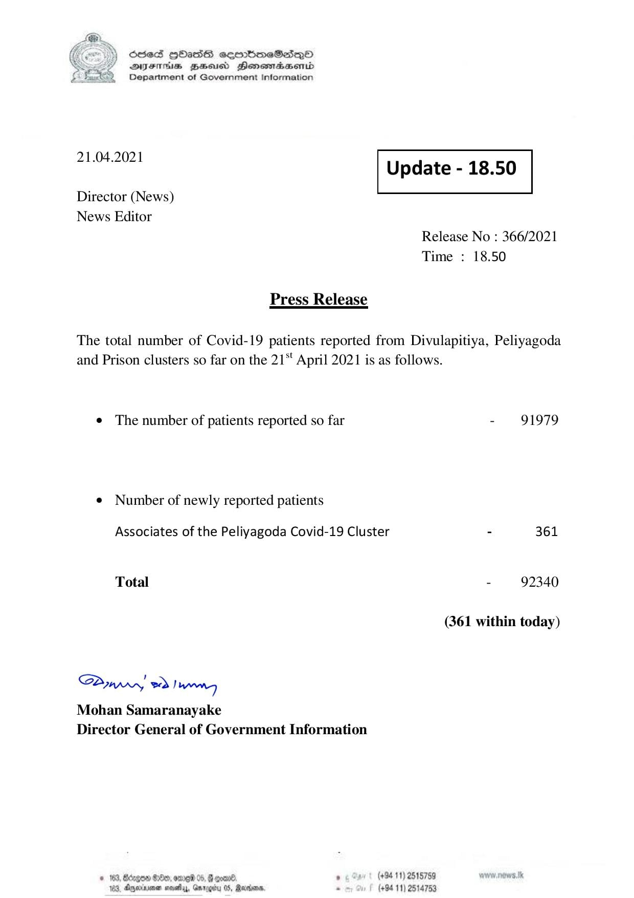

# Press Release - 2021.04.21 
Key: e43308e9c8459076ffa171b6cf0f7c1a 

---
```
6c8eS HDASH sermbmeSasqo
DIFTHsS BHusd Heonemaaentd
Department of Government Information

21.04.2021 Update - 18.50

Director (News)
News Editor

 

Release No : 366/2021
Time : 18.50

Press Release
The total number of Covid-19 patients reported from Divulapitiya, Peliyagoda

and Prison clusters so far on the 21“ April 2021 is as follows.

e The number of patients reported so far - 91979

¢ Number of newly reported patients
Associates of the Peliyagoda Covid-19 Cluster - 361
Total - 92340

(361 within today)

Saw 2) wn,
Mohan Samaranayake
Director General of Government Information

© 163, Bdzgow er, ore 05, § ooone , (+94 11) 2518759
183, Ageinener sey, Garogity 05, Rares - (+94 11) 2514753

```
