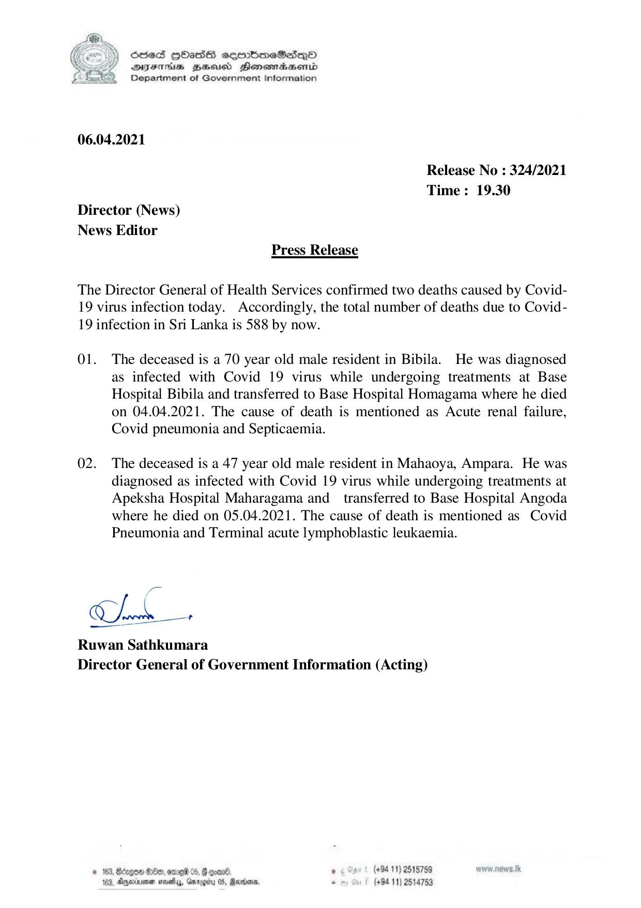

# Press Release - 2021.04.06 - Covid 19 Infection deaths 
Key: e456a80f866e483426971c4ad8aa4e82 

---
```
NY Scdes HhasS coorbmeSedqQoO
DEFIHS BHousd Honowmaasenid
Department of Government Information

 

06.04.2021

Release No : 324/2021
Time: 19.30
Director (News)
News Editor
Press Release

The Director General of Health Services confirmed two deaths caused by Covid-
19 virus infection today. Accordingly, the total number of deaths due to Covid-
19 infection in Sri Lanka is 588 by now.

01. The deceased is a 70 year old male resident in Bibila. He was diagnosed
as infected with Covid 19 virus while undergoing treatments at Base
Hospital Bibila and transferred to Base Hospital Homagama where he died
on 04.04.2021. The cause of death is mentioned as Acute renal failure,
Covid pneumonia and Septicaemia.

02. The deceased is a 47 year old male resident in Mahaoya, Ampara. He was
diagnosed as infected with Covid 19 virus while undergoing treatments at
Apeksha Hospital Maharagama and _ transferred to Base Hospital Angoda
where he died on 05.04.2021. The cause of death is mentioned as Covid
Pneumonia and Terminal acute lymphoblastic leukaemia.

ig

Conde +

Ruwan Sathkumara
Director General of Government Information (Acting)

© 183, Bdcgoe Be, ome 05, G goed, . (+94 11) 2515759
103, Doyeririenen moiety, Garogiby 08, Reardon, . (+84 11) 2514753

```
