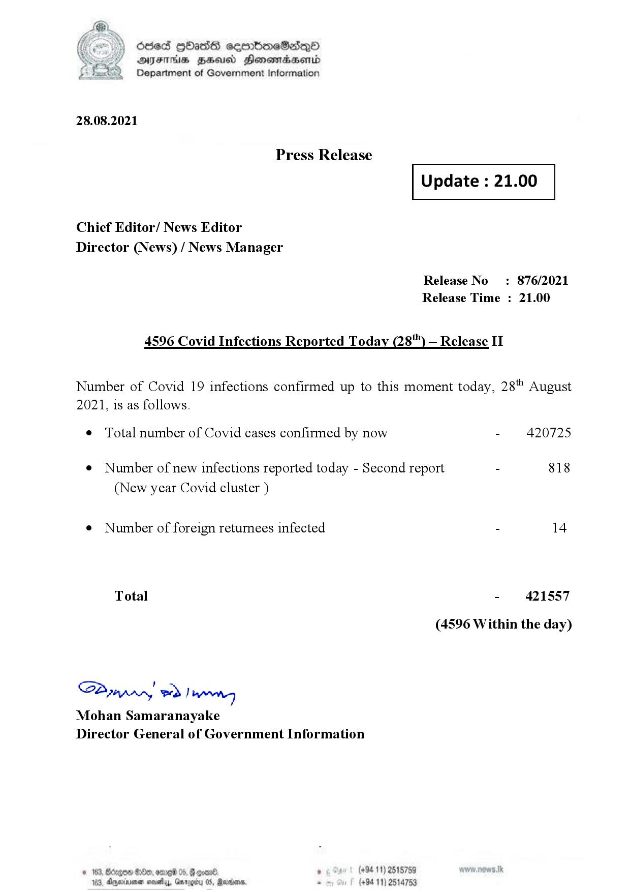

# Press Release - 2021.08.28 - Covid 19 Infection Report 
Key: e493136ead1bc10b82e64070406ccaca 

---
```
dosed GOass eemmbmeSadepO
DFS BHU Honswnradasentd
Department of Government Information

 

 

28.08.2021

Press Release

Chief Editor/ News Editor
Director (News) / News Manager

 

 

Update : 21.00

 

 

Release No: 876/2021
Release Time : 21.00

4596 Covid Infections Reported Today (28") — Release II

Number of Covid 19 infections confirmed up to this moment today, 28" August

2021, is as follows.

¢ Total number of Covid cases confirmed by now

¢ Number of new infections reported today - Second report

(New year Covid cluster )

¢ Number of foreign returnees infected

Total

SPynprn wd Ing
Mohan Samaranayake
Director General of Government Information

© 163, Bicegeen Be, ome 05, @
103, Dnerisemen saves, aro

 

. (+94 11) 2515759
(+94 11) 2514753

- 420725

818

- 421557
(4596 Within the day)

```
