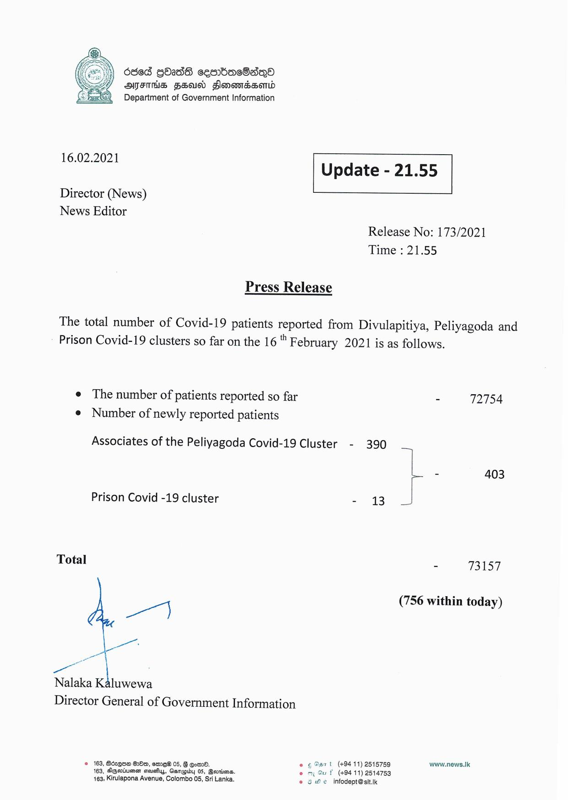

# Press Release - 2021.02.16 
Key: e644cbda98e4678cad4ab715b9b5885a 

---
```
6863 gOadsdS cesrbacSaqo
AFIS FSA Slonomdsond
==} Department of Government Information

  

 

16.02.2021 Update - 21.55

 

 

 

Director (News)

News Editor
Release No: 173/2021
Time : 21.55

Press Release

The total number of Covid-19 patients reported from Divulapitiya, Peliyagoda and
Prison Covid-19 clusters so far on the 16 " February 2021 is as follows.

e The number of patients reported so far - 72754
e Number of newly reported patients

Associates of the Peliyagoda Covid-19 Cluster - 390
- 403

Prison Covid -19 cluster - 13

Total - Talat

(756 within today)

we)

Nalaka Kaluwewa

Director General of Government Information

© 163, Bézqua 28m, ome® 05, 6 Com. e 69571 (+94 11) 2515759 www.news.Ik
163, Agerineen seushys, Ganupiby 05, Bsvriiens. © Su f (+94 11) 2514753
163; Kirulapona Avenue, Colombo 05, Sri Lanka. e oe infodept@sit.k

```
