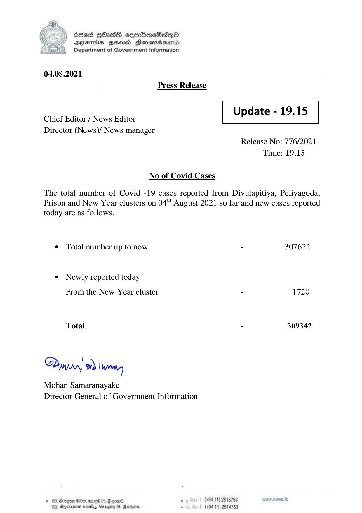

# Press Release  - 2021.08.04 
Key: e66a79e97061f0fa97504b14ce1b4f5e 

---
```
| OCced gbass cembmeSadqQo
DFIHS BHU Honsordaentd
Department of Government Information

 

04.08.2021
Press Release

 

Update - 19.15

 

 

Chief Editor / News Editor
Director (News)/ News manager

 

Release No: 776/2021
Time: 19.15

No of Covid Cases

The total number of Covid -19 cases reported from Divulapitiya, Peliyagoda,
Prison and New Year clusters on 04" August 2021 so far and new cases reported
today are as follows.

¢ Total number up to now - 307622

¢ Newly reported today
From the New Year cluster - 1720

Total - 309342

Dinrrr, wd Iwo

Mohan Samaranayake
Director General of Government Information

© 163, Bdxgon Oe, ore 05, G qomn6. . (+94 11) 2515789
163, Ageia nosey, Gnrogiry 05, Rares, - (+94 11) 2514753

```
