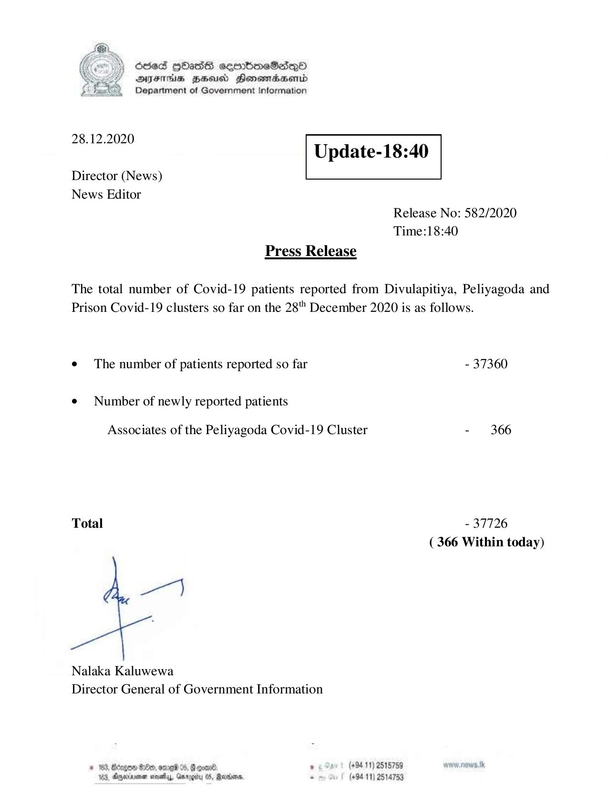

# Press Release - 2020.12.28 
Key: e7014a9e23e6283e34acb722088a20f0 

---
```
6563 HOHasG sembmcSasqQo
DAJFITAs BHU Honomrdbsertd
Department of Government Information

 

 

28.12.2020
Update-18:40

 

 

 

Director (News)
News Editor
Release No: 582/2020
Time:18:40
Press Release

The total number of Covid-19 patients reported from Divulapitiya, Peliyagoda and
Prison Covid-19 clusters so far on the 28"" December 2020 is as follows.
¢ The number of patients reported so far - 37360

¢ Number of newly reported patients

Associates of the Peliyagoda Covid-19 Cluster - 366

Total - 37726
( 366 Within today)

Nalaka Kaluwewa
Director General of Government Information

* 163, Bcogen G00, emei %, G goad . (+94 11) 2515759 www. news. tk
123, Oneiarnen nova, Grrogiy 05, Radars. . (+9411) 2514753

```
