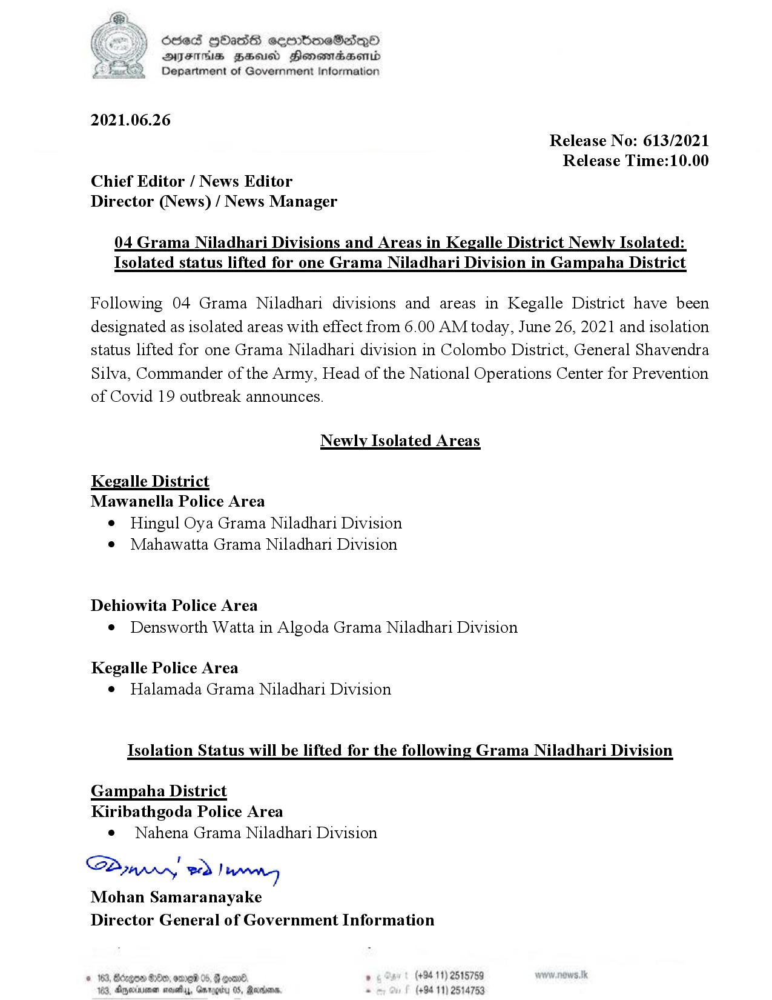

# Press Release - 2021.06.26 - Newly isolated areas and Isolated lifting areas 
Key: e705aed498269f22888eaa81dd7cc02a 

---
```
Sed HOHass semboeSasqQo
DFITHs HHuUSd Honomabsentd
Department of Government Information

 

2021.06.26
Release No: 613/2021
Release Time:10.00
Chief Editor / News Editor
Director (News) / News Manager

04 Grama Niladhari Divisions and Areas in Kegalle District Newly Isolated:
Isolated status lifted for one Grama Niladhari Division in Gampaha District

Following 04 Grama Niladhari divisions and areas in Kegalle District have been
designated as isolated areas with effect from 6.00 AM today, June 26, 2021 and isolation
status lifted for one Grama Niladhari division in Colombo District, General Shavendra
Silva, Commander of the Army, Head of the National Operations Center for Prevention
of Covid 19 outbreak announces.

Newly Isolated Areas

Kegalle District
Mawanella Police Area

¢ Hingul Oya Grama Niladhari Division
e Mahawatta Grama Niladhari Division

Dehiowita Police Area
¢ Densworth Watta in Algoda Grama Niladhari Division

Kegalle Police Area
e Halamada Grama Niladhari Division

Isolation Status will be lifted for the following Grama Niladhari Division

Gampaha District
Kiribathgoda Police Area

e Nahena Grama Niladhari Division

SA eed hiateney
Mohan Samaranayake
Director General of Government Information

 

. (+94 11) 2518759
Barons, . (+94 11) 2514753

© 163, Bdegoe #80, omred 05, §
108, Anexirenen novelas, Gar99

    

```
