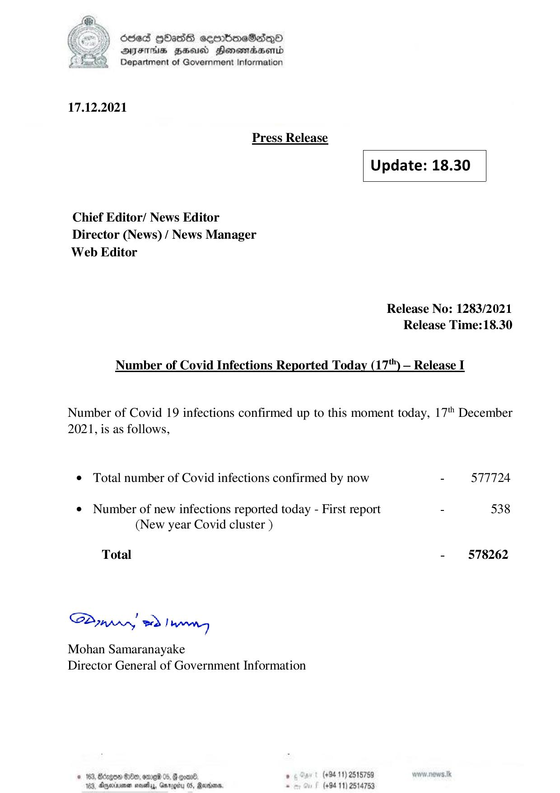

# Press Release - 2021.12.17 
Key: e7604f9fae44749f0df9016f8740dd34 

---
```
) dcded QhasS ceerbneSdiqQo
DFTs HH Honsomadsenid
Department of Government Information

 

 

17.12.2021
Press Release
Update: 18.30
Chief Editor/ News Editor
Director (News) / News Manager
Web Editor

Release No: 1283/2021
Release Time:18.30

Number of Covid Infections Reported Today (17") — Release I

Number of Covid 19 infections confirmed up to this moment today, 17" December
2021, is as follows,

© Total number of Covid infections confirmed by now - 577724

¢ Number of new infections reported today - First report - 538
(New year Covid cluster )

- 578262

Total

Sa mprr wd! bong

Mohan Samaranayake
Director General of Government Information

(+94 11) 2515759
(+94 11) 2514753

 

© 163, Bdzgon Oe, ore 05, B coal.
163, Apexnener sevethys, Garogiry 0S, Rare,

```
