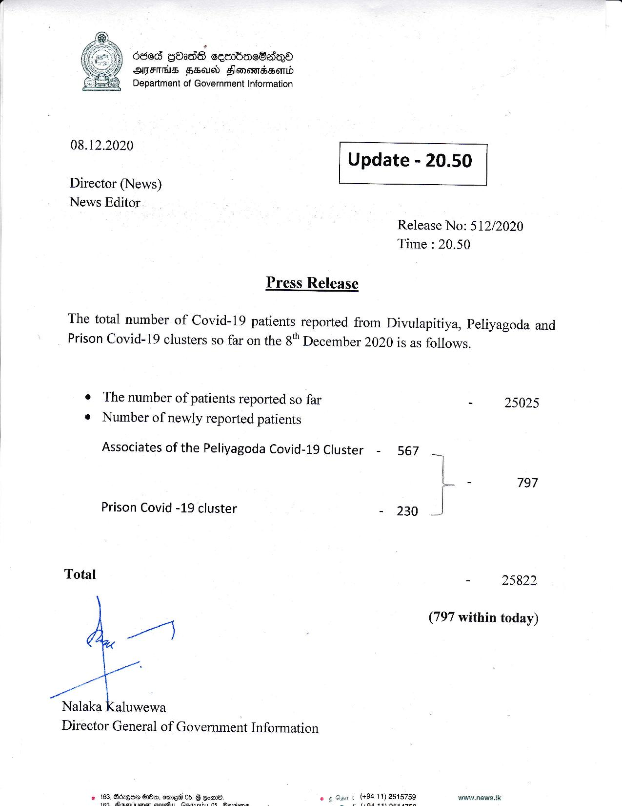

# Press Release - 2020.12.08 
Key: e761e64d376bb7d126f14567a42c9de3 

---
```
| deed GOadG sembac8adm
ATITHS FZeasd SFlonemssenLd
Department of Government Information

 

 

08.12.2020 Update - 20.50

 

 

 

Director (News)

News Editor
Release No: 512/2020
Time : 20.50

Press Release

The total number of Covid-19 patients reported from Divulapitiya, Peliyagoda and
Prison Covid-19 clusters so far on the 8 December 2020 is as follows.

¢ The number of patients reported so far - 25025
¢ Number of newly reported patients

Associates of the Peliyagoda Covid-19 Cluster - 567 _.

L - 797

Prison Covid -19 cluster - 230

Total - 25822

(797 within today)

a}

viata aluwewa
Director General of Government Information

waww.news.tk

   

```
