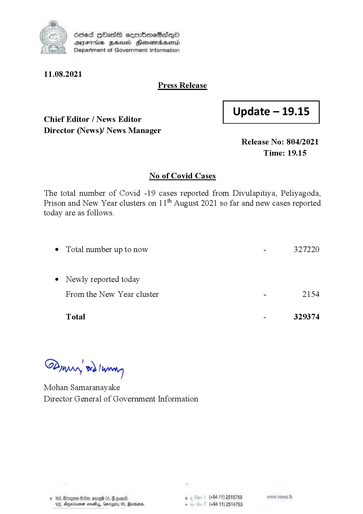

# Press Release - 2021.08.11 
Key: e7ad8279fc675fe8b3c55f84554ec7b5 

---
```
) ésed |HHasS seenbmeSad—o
DFS HHS Hensrradaentd
Department of Government Information

 

11.08.2021
Press Release

 

Update — 19.15

 

 

Chief Editor / News Editor
Director (News)/ News Manager

 

Release No: 804/2021
Time: 19.15

No of Covid Cases

The total number of Covid -19 cases reported from Divulapitiya, Peliyagoda,
Prison and New Year clusters on 11" August 2021 so far and new cases reported
today are as follows.

¢ Total number up to now - 327220

e Newly reported today
From the New Year cluster - 2154

Total - 329374

Dyry » |Wwreteg

Mohan Samaranayake
Director General of Government Information

8x9, on om ’ (+94 11) 2518759
05, Reanvens. - (+94 11) 2514753

© 163, Bdrge
183, Dexia noe, G

 
 

```
