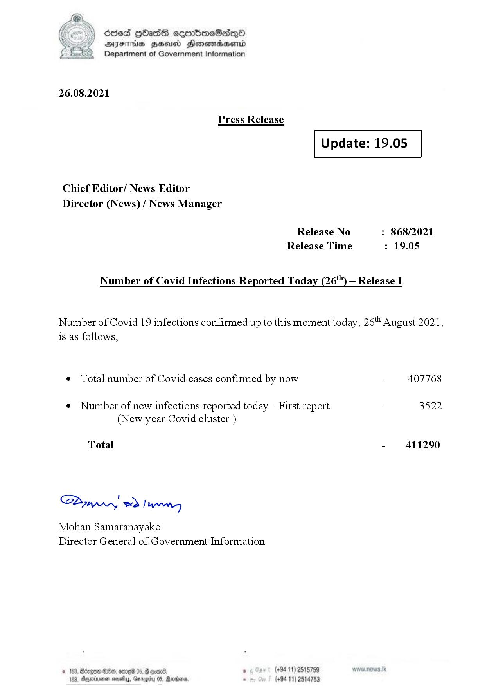

# Press Release - 2021.08.26 
Key: e8c79f26db1b4b08b7dbc12c0c378000 

---
```
)) died QOadS cemmboeSdqQa
DFS HHS Honsmnadaerntd
Department of Government Information

 

26.08.2021

Press Release

 

Update: 19.05

 

 

 

Chief Editor/ News Editor
Director (News) / News Manager

Release No : 868/2021
Release Time : 19.05

Number of Covid Infections Reported Today (26") — Release I

Number of Covid 19 infections confirmed up to this moment today, 26" August 2021,
is as follows,

¢ Total number of Covid cases confirmed by now - 407768

¢ Number of new infections reported today - First report - 3522
(New year Covid cluster )

Total - 411290

SB, eed | Mens

Mohan Samaranayake
Director General of Government Information

   

188, Anexivenan noes, Garogiy 05, Mardoorn,

```
