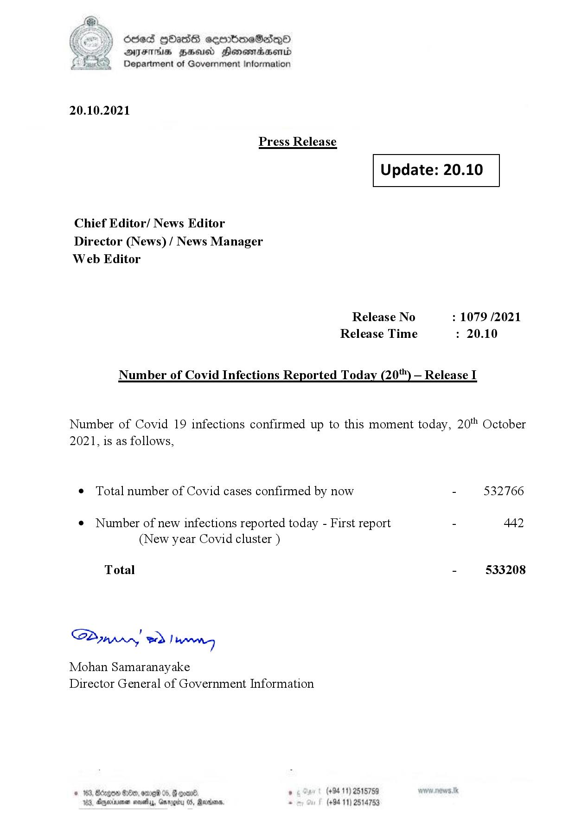

# Press Release  - 2021.10.20 
Key: e921e4af75789b3356d43ea614eea540 

---
```
(oe) Sed QOass cerrbroeSadqQo
DFS HHS Honsmnadaerntd
Department of Government Information

 

20.10.2021

Press Release

 

 

Update: 20.10

 

 

Chief Editor/ News Editor
Director (News) / News Manager
Web Editor

Release No : 1079 /2021
Release Time : 20.10

Number of Covid Infections Reported Today (20') — Release I

Number of Covid 19 infections confirmed up to this moment today, 20 October
2021, is as follows,

¢ Total number of Covid cases confirmed by now - 532766

¢ Number of new infections reported today - First report - 442
(New year Covid cluster )

- 533208

Total

Sa mprn! wd! wong

Mohan Samaranayake
Director General of Government Information

(+94 11) 2515759
(+94 11) 2514753

 

```
