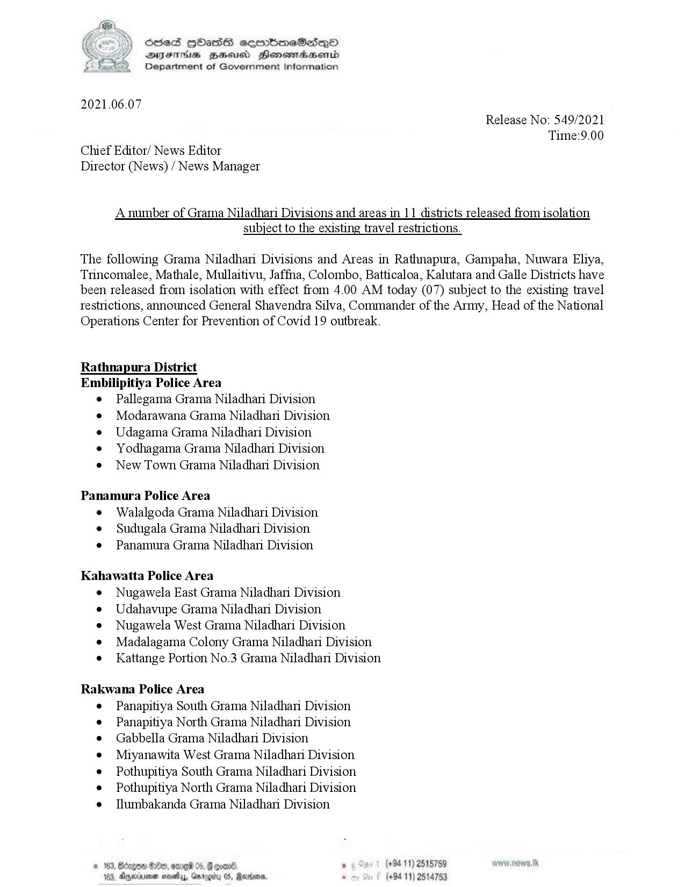

# Press Release - 2021.06.07 - A number of Grama Niladhari Divisions and areas in 11 districts released from isolation subject to the existing travel restrictions 
Key: e97cadd354d42d5987d7348f1df50ad2 

---
```
 

Sed HbHas sermbmeSiesqn©
DYsFThis ZHsusd Honemadaemd
Department of Government Information

 

2021.06.07

Chief Editor/ News Editor
Director (News) / News Manager

Release No: 549/2021
Time:9.00

Anumber of Grama Niladhari Divisions and areas in 11 districts released from isolation

subject to the existing travel restrictions.

The following Grama Niladhari Divisions and Areas in Rathnapura, Gampaha, Nuwara Eliya,
Trincomalee, Mathale, Mullaitivu, Jaffna, Colombo, Batticaloa, Kalutara and Galle Districts have
been released from isolation with effect from 4.00 AM today (07) subject to the existing travel
restrictions, announced General Shavendra Silva, Commander of the Army, Head of the National

Operations Center for Prevention of Covid 19 outbreak.

Rathnapura District
Embilipitiya Police Area

Pallegama Grama Niladhan Division
Modarawana Grama Niladhari Division
Udagama Grama Niladhari Division
Yodhagama Grama Niladhari Division
New Town Grama Niladhari Division.

Panamura Police Area
e Walalgoda Grama Niladhari Division
e Sudugala Grama Niladhari Division
e Panamura Grama Niladhani Division

Kahawatta Police Area

e Nugawela East Grama Niladhari Division
Udahavupe Grama Niladhari Division
Nugawela West Grama Niladhari Division
Madalagama Colony Grama Niladhari Division
Kattange Portion No.3 Grama Niladhari Division

Rakwana Police Area

Panapitiya South Grama Niladhari Division
Panapitiya North Grama Niladhari Division
Gabbella Grama Niladhari Division.
Miyanawita West Grama Niladhari Division
Pothupitiya South Grama Niladhari Division
Pothupitiya North Grama Niladhari Division
Ilumbakanda Grama Niladhari Division

 

(+94 11) 2515759
(+94 11) 2514753

```
