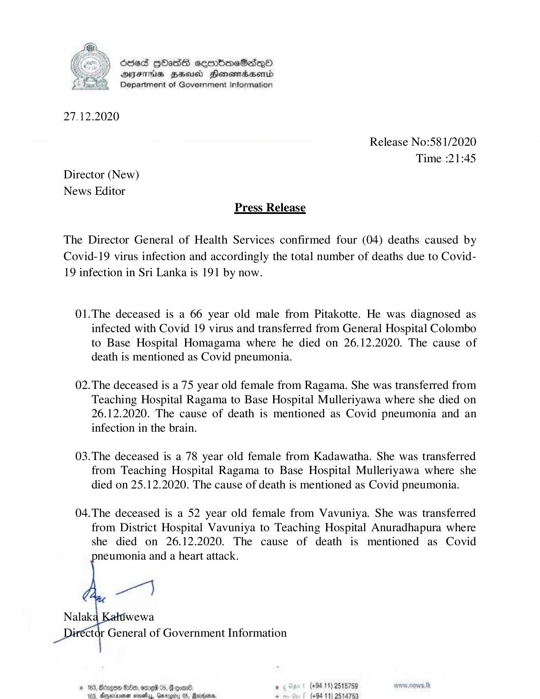

# Press Release - 2020.12.27 - 04 Covid 19 infection deaths has been reported,total number of deaths rises to 191 
Key: e9afbd9aa69faf529c6c78933c7586a8 

---
```
) Scse3 HOasS seenbreSad_Qo
AIFS BHU Honemadsenid
Department of Government Information

 

27.12.2020

Release No:58 1/2020
Time :21:45
Director (New)
News Editor
Press Release

The Director General of Health Services confirmed four (04) deaths caused by
Covid-19 virus infection and accordingly the total number of deaths due to Covid-
19 infection in Sri Lanka is 191 by now.

01.The deceased is a 66 year old male from Pitakotte. He was diagnosed as
infected with Covid 19 virus and transferred from General Hospital Colombo
to Base Hospital Homagama where he died on 26.12.2020. The cause of
death is mentioned as Covid pneumonia.

02.The deceased is a 75 year old female from Ragama. She was transferred from
Teaching Hospital Ragama to Base Hospital Mulleriyawa where she died on
26.12.2020. The cause of death is mentioned as Covid pneumonia and an
infection in the brain.

03.The deceased is a 78 year old female from Kadawatha. She was transferred
from Teaching Hospital Ragama to Base Hospital Mulleriyawa where she
died on 25.12.2020. The cause of death is mentioned as Covid pneumonia.

04.The deceased is a 52 year old female from Vavuniya. She was transferred
from District Hospital Vavuniya to Teaching Hospital Anuradhapura where
she died on 26.12.2020. The cause of death is mentioned as Covid
neumonia and a heart attack.

  
  

ctor General of Government Information

© 163, Aegon G80, ome 05, § gone. , (+9411) 2515759
duc nctasiiun :stewelias, Ciicacias (6: mii. = (94-11) 2514759

 

```
