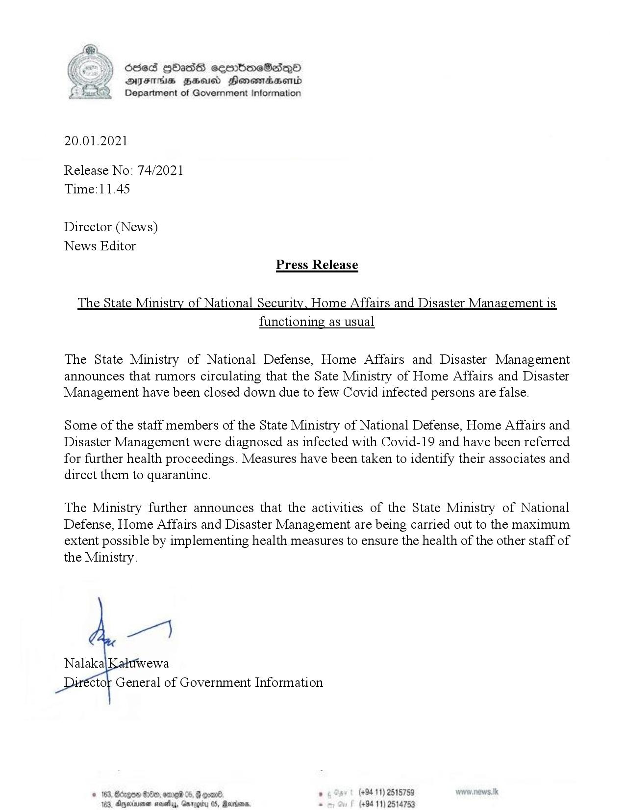

# Press Release - 2021.01.20 - The State Ministry of National Security,Home Affairs and Disaster Management is functioning as usual 
Key: ea698a691d8d88b5948b2c9be6660dad 

---
```
osed HHasG ceorboeSadq®
AIFS HHA Honemtradaentd
Department of Government Information

  

20.01.2021

Release No: 74/2021
Time:11.45

Director (News)
News Editor
Press Release

The State Ministry of National Security, Home Affairs and Disaster Management is
functioning as usual

The State Ministry of National Defense, Home Affairs and Disaster Management
announces that rumors circulating that the Sate Ministry of Home Affairs and Disaster
Management have been closed down due to few Covid infected persons are false.

Some of the staff members of the State Ministry of National Defense, Home Affairs and
Disaster Management were diagnosed as infected with Covid-19 and have been referred
for further health proceedings. Measures have been taken to identify their associates and
direct them to quarantine.

The Ministry further announces that the activities of the State Ministry of National
Defense, Home Affairs and Disaster Management are being carried out to the maximum
extent possible by implementing health measures to ensure the health of the other staff of
the Ministry.

wey

Nalaka wewa
ctor General of Government Information

° (+94 11) 2515789
(+94 11) 2514753

    

```
