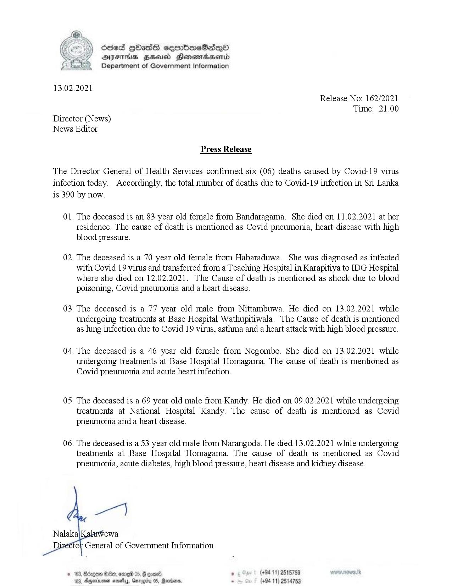

# Press Release - 2021.02.13 - Covid 19 infection deaths 
Key: eb1e2148394be5086df1109d495613d6 

---
```
 

dosed HbHasG sembmeSadqoO
AFIS BHU Honewmadsentd
Department of Government Information

13.02.2021

Release No: 162/2021
Time: 21.00

Director (News)
News Editor

Press Release

The Director General of Health Services confirmed six (06) deaths caused by Covid-19 virus
infection today. Accordingly, the total number of deaths due to Covid-19 infection in Sri Lanka
is 390 by now.

01.

02.

03.

04.

0S.

06.

The deceased is an 83 year old female from Bandaragama. She died on 11.02.2021 at her
tesidence. The cause of death is mentioned as Covid pneumonia, heart disease with high
blood pressure.

The deceased is a 70 year old female from Habaraduwa. She was diagnosed as infected
with Covid 19 virus and transferred from a Teaching Hospital in Karapitiya to IDG Hospital
where she died on 12.02.2021. The Cause of death is mentioned as shock due to blood
poisoning, Covid pneumoma and a heart disease.

The deceased is a 77 year old male from Nittambuwa. He died on 13.02.2021 while
undergoing treatments at Base Hospital Wathupitiwala. The Cause of death is mentioned
as lung infection due to Covid 19 virus, asthma and a heart attack with high blood pressure.

The deceased is a 46 year old female from Negombo. She died on 13.02.2021 while
undergoing treatments at Base Hospital Homagama. The cause of death is mentioned as
Covid pneumonia and acute heart infection.

The deceased is a 69 year old male from Kandy. He died on 09.02.2021 while undergoing
treatments at National Hospital Kandy. The cause of death is mentioned as Covid
pneumonia and a heart disease.

The deceased is a 53 year old male from Narangoda. He died 13.02.2021 while undergoing
treatments at Base Hospital Homagama. The cause of death is mentioned as Covid
pneumonia, acute diabetes, high blood pressure, heart disease and kidney disease.

wen)

Nalaka’ rewa

Di

 

‘of General of Government Information

. (+94 11) 2515759
. (+94 11) 2514753

 

```
