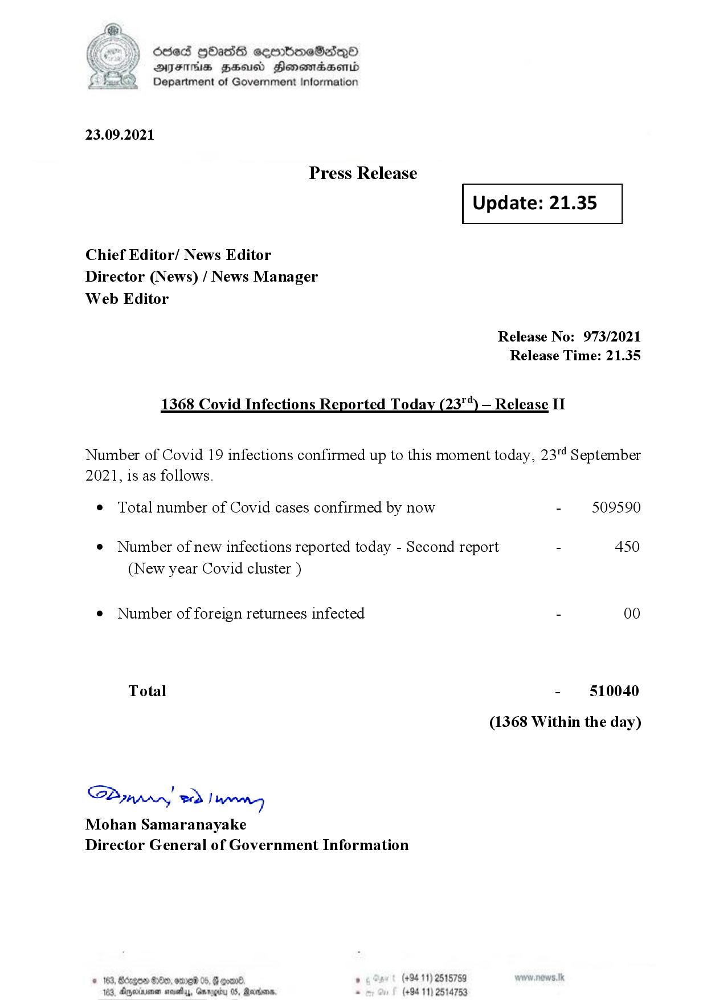

# Press Release - 2021.09.23 - Covid 19 Infection Report 
Key: ebf93f36ba0745c3951e4d48d636448a 

---
```
dosed GOass eemmbmeSadepO
DFS BHU Honswnradasentd
Department of Government Information

 

 

23.09.2021

Press Release

Chief Editor/ News Editor
Director (News) / News Manager
Web Editor

1368 Covid Infections Reported Today (23"*) — Release II

 

 

Update: 21.35

 

 

Release No: 973/2021
Release Time: 21.35

Number of Covid 19 infections confirmed up to this moment today, 23" September

2021, is as follows.

¢ Total number of Covid cases confirmed by now

¢ Number of new infections reported today - Second report

(New year Covid cluster )

¢ Number of foreign returnees infected

Total

Saar eed } hang
Mohan Samaranayake
Director General of Government Information

© 163, Oe, ome 05,  goan8 ,

 

(+94 11) 2515759
163, Agperxnsenen save, Garogiiry 05, Rarrionn, - (+94 11) 2514753

509590

450

00

510040

(1368 Within the day)

```
