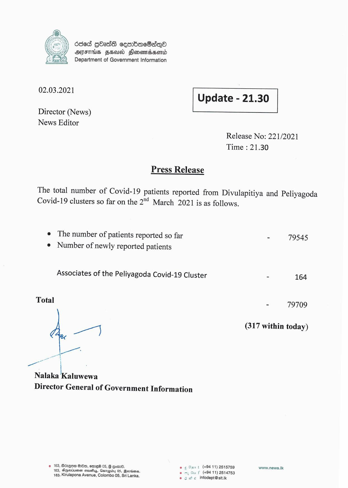

# Press Release - 2021.03.02 
Key: ec48102737ed4bd16965cf33f33fd2de 

---
```
6368 GOass cesrbac8aqQO
ATES FEU Slonomessontd
Department of Government Information

 

 

02.03.2021 Update - 21.30

 

 

 

Director (News)

News Editor
Release No: 221/2021
Time : 21.30

Press Release

The total number of Covid-19 patients reported from Divulapitiya and Peliyagoda
Covid-19 clusters so far on the 2"! March 2021 is as follows.

¢ The number of patients reported so far - 79545
¢ Number of newly reported patients

Associates of the Peliyagoda Covid-19 Cluster - 164

Total 79709

os (317 within today)

Nalaka Kaluwewa
Director General of Government Information

© 163, Bdxgoa 00, ame 05, § Com. °
163, Agertiuemsn creusuy, Gaupidy 05, Bevdions,
163; Kirulapona Avenue, Colombo 05, Sri Lanka.

vt (+9411) 2515759 www.news.Ik
(+94 11) 2514753
e infodept@sit.ik

   

```
